# 📊 Diagramas UML - Sistema Dental Company Web

Este documento contiene los diagramas UML del sistema de gestión para clínicas dentales.
Los diagramas están escritos en sintaxis PlantUML y pueden visualizarse en [PlantText](https://www.planttext.com/).

---

## 📑 Índice

1. [Diagrama de Casos de Uso](#1-diagrama-de-casos-de-uso)
2. [Diagrama de Clases](#2-diagrama-de-clases)
3. [Diagramas de Secuencia](#3-diagramas-de-secuencia)
4. [Modelo Relacional de Base de Datos](#4-modelo-relacional-de-base-de-datos)
5. [Diagrama de Componentes](#5-diagrama-de-componentes)
6. [Diagrama de Estados](#6-diagrama-de-estados)
7. [Diagrama de Actividades](#7-diagrama-de-actividades)
8. [Diagrama de Despliegue](#8-diagrama-de-despliegue)

---

## 1. Diagrama de Casos de Uso

### 1.1 Casos de Uso General del Sistema

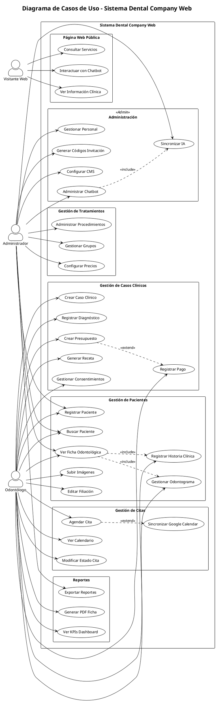

### 1.2 Casos de Uso - Gestión de Pacientes (Detallado)

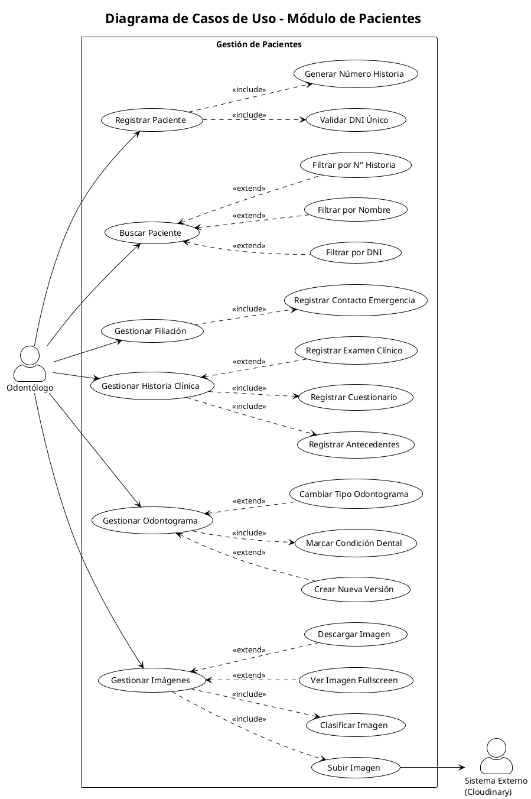

---

## 2. Diagrama de Clases

### 2.1 Diagrama de Clases Principal

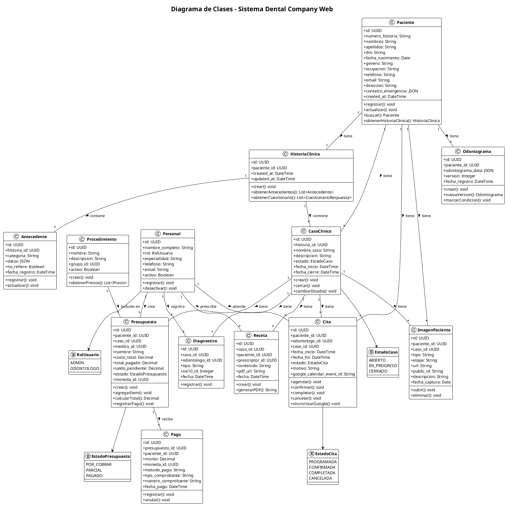

### 2.2 Diagrama de Clases - Módulo CMS y Chatbot

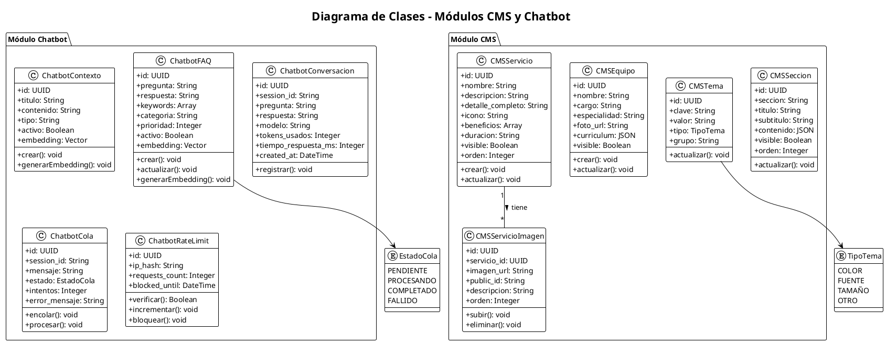

---

## 3. Diagramas de Secuencia

### 3.1 Registro de Nuevo Paciente

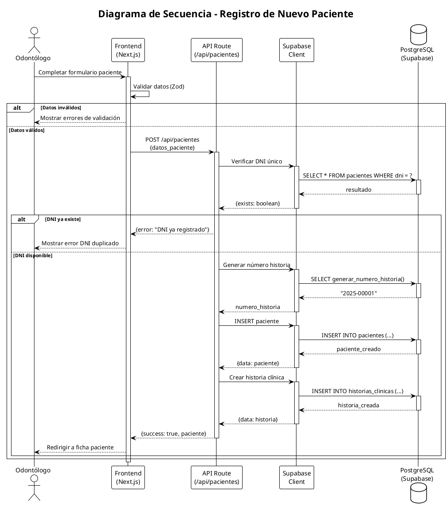

### 3.2 Crear Presupuesto y Registrar Pago

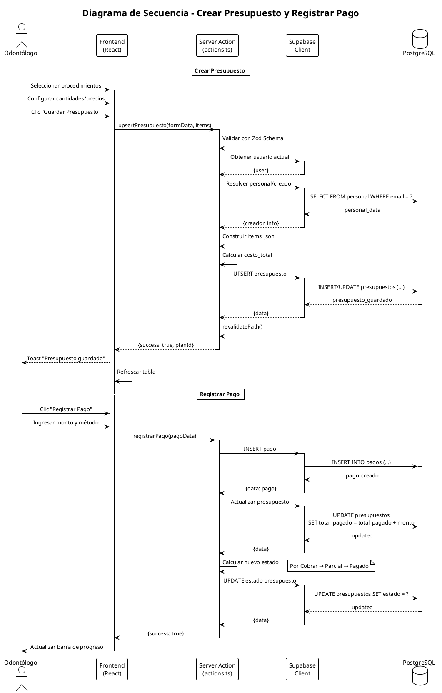

### 3.3 Agendar Cita con Sincronización Google Calendar

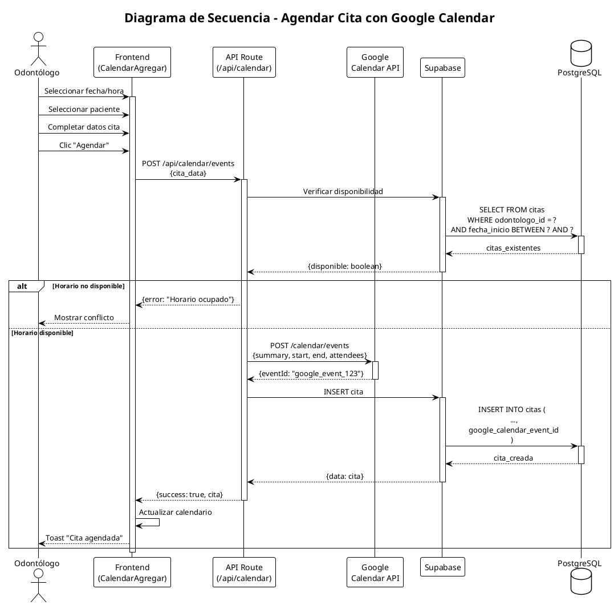

### 3.4 Interacción con Chatbot (RAG)

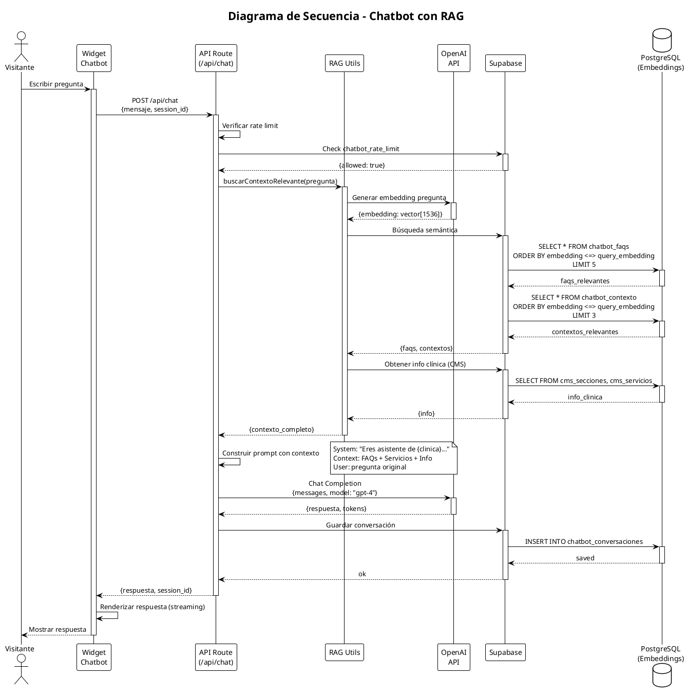

---

## 4. Modelo Relacional de Base de Datos

### 4.1 Modelo ER Completo

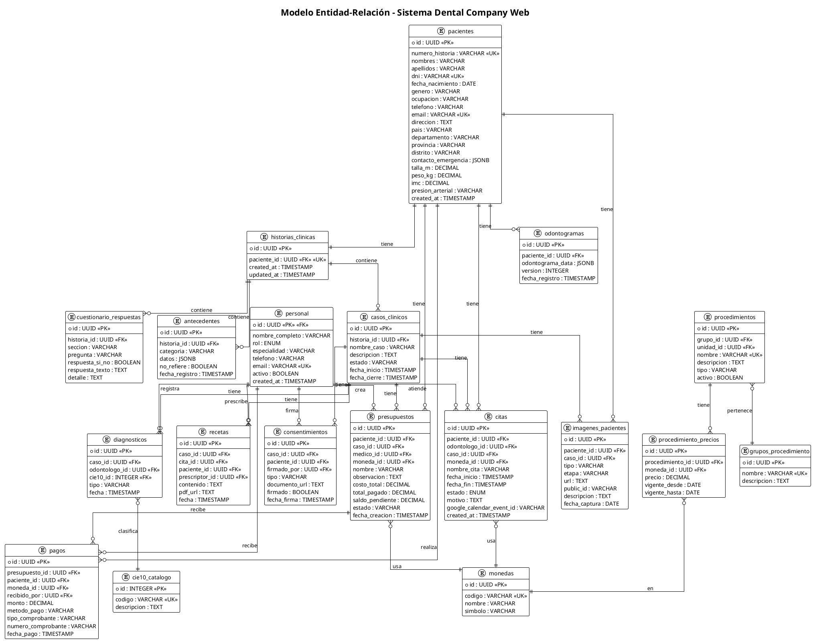

### 4.2 Modelo ER - Módulo CMS y Chatbot

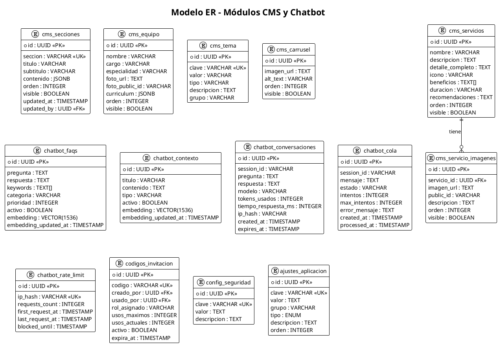

---

## 5. Diagrama de Componentes

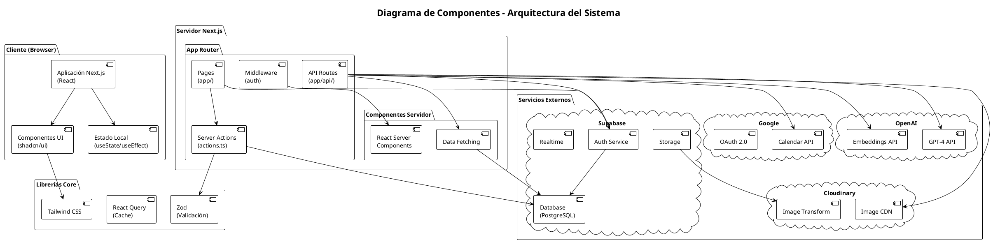

---

## 6. Diagrama de Estados

### 6.1 Estados de un Caso Clínico

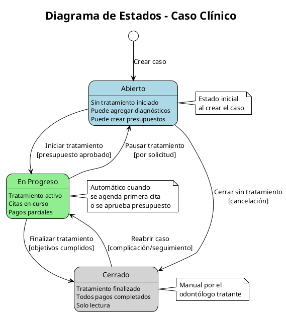

### 6.2 Estados de una Cita

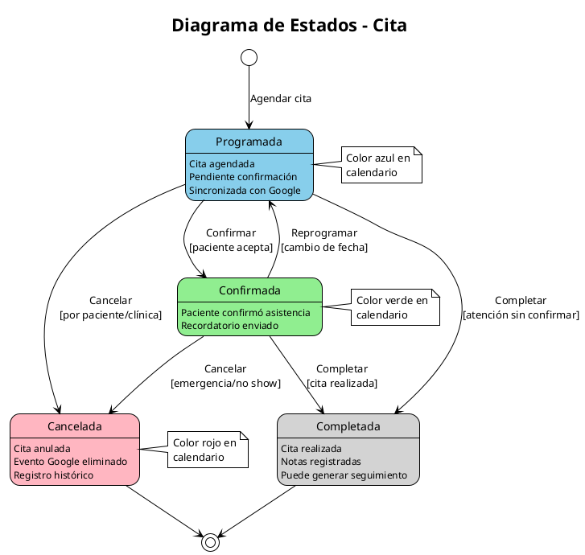

### 6.3 Estados de un Presupuesto

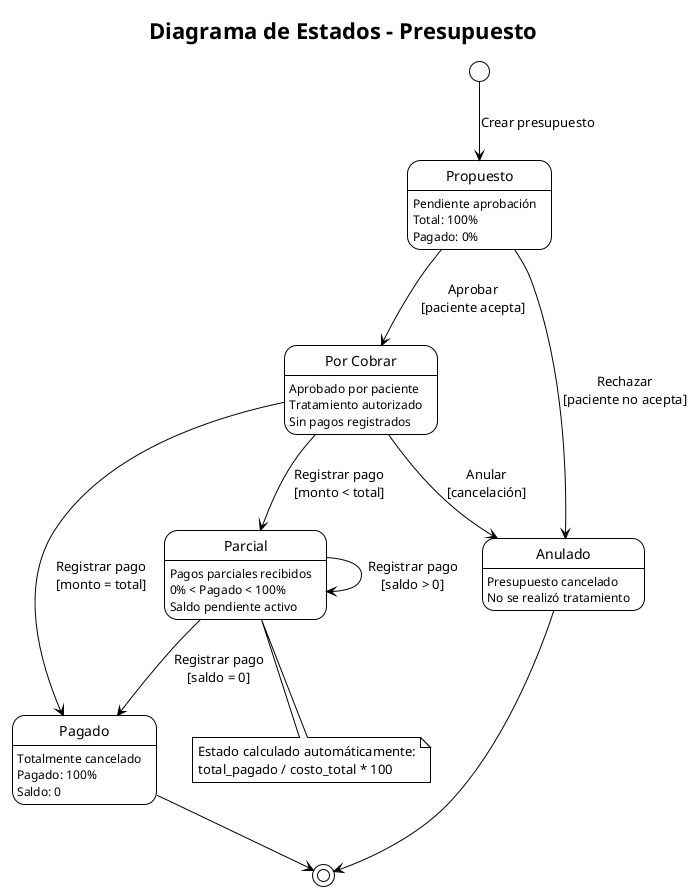

---

## 7. Diagrama de Actividades

### 7.1 Proceso de Atención al Paciente

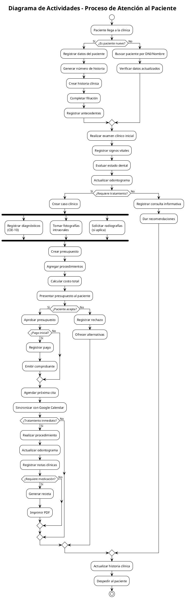

### 7.2 Proceso de Gestión de Citas

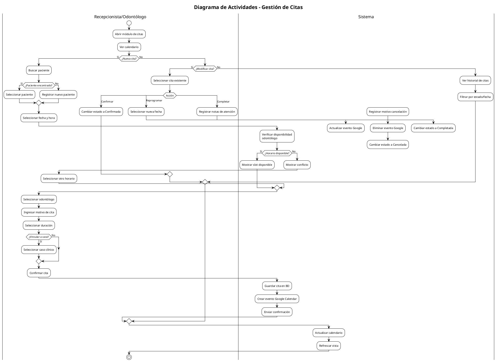

---

## 8. Diagrama de Despliegue

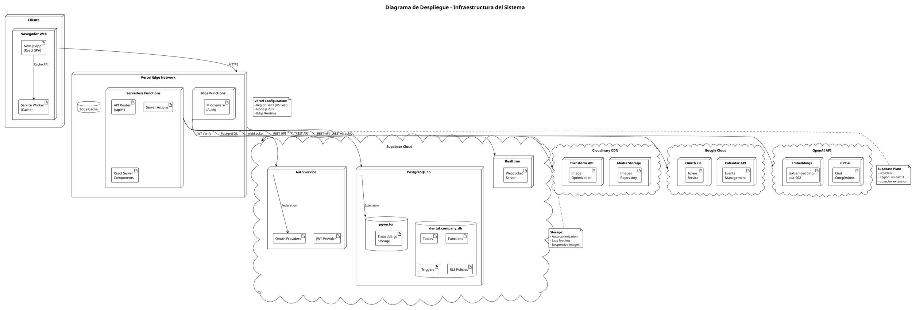

---

## 📝 Notas de Implementación

### Herramientas Utilizadas
- **Frontend:** Next.js 14, React, TypeScript, Tailwind CSS, shadcn/ui
- **Backend:** Next.js API Routes, Server Actions
- **Base de Datos:** PostgreSQL (Supabase)
- **Autenticación:** Supabase Auth con JWT
- **Almacenamiento de Imágenes:** Cloudinary
- **IA/Chatbot:** OpenAI GPT-4, pgvector para embeddings
- **Calendario:** Google Calendar API

### Convenciones de Diagramas
- Los colores en diagramas de estado indican el nivel de actividad
- Las relaciones con líneas punteadas indican dependencias opcionales
- Los estereotipos `<<include>>` y `<<extend>>` siguen la notación UML estándar

---

**Documento generado:** Diciembre 2025  
**Sistema:** Dental Company Web v1.0
