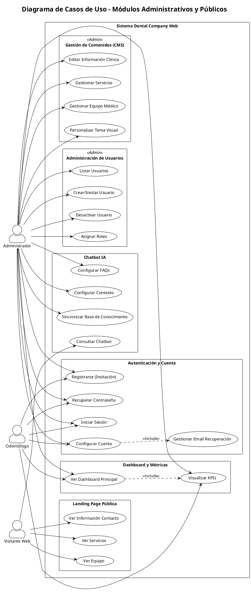
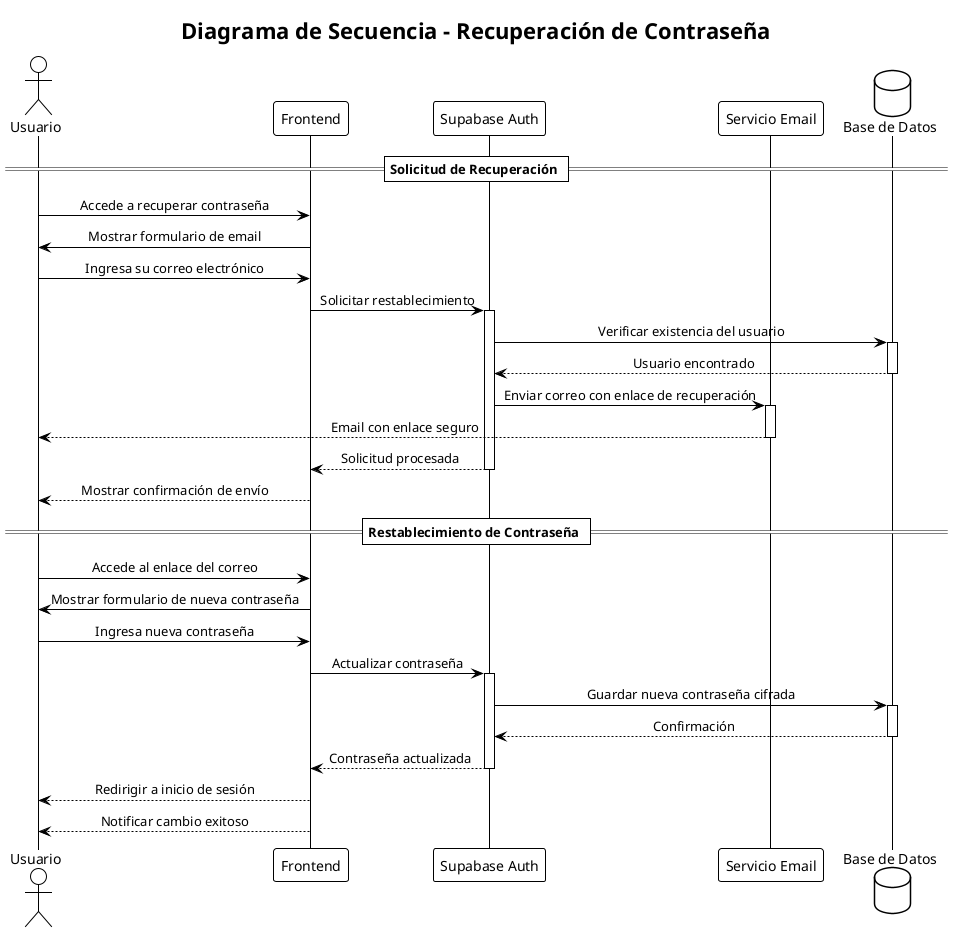
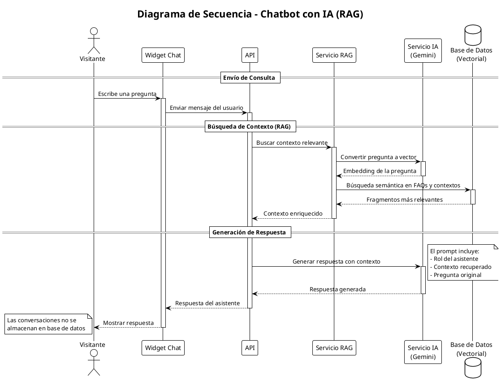
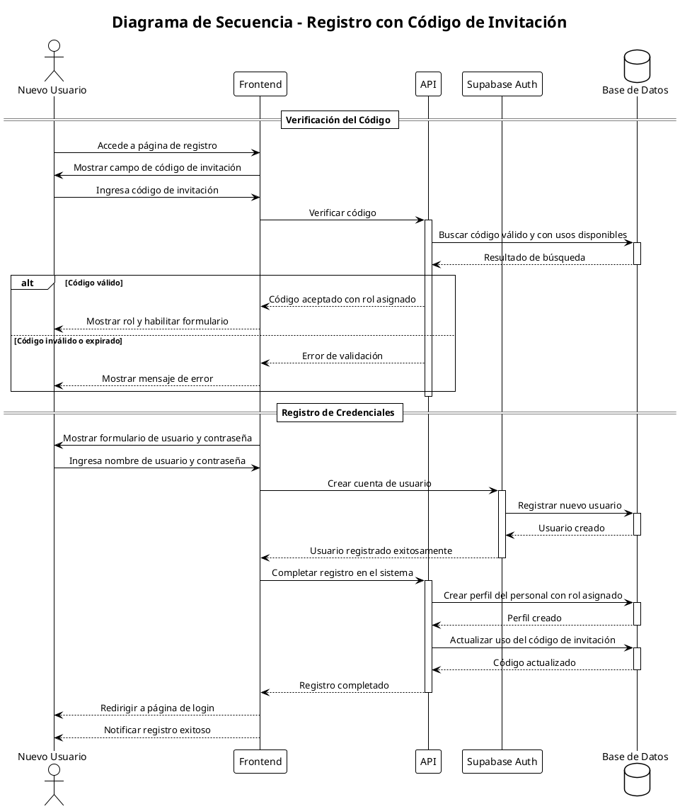
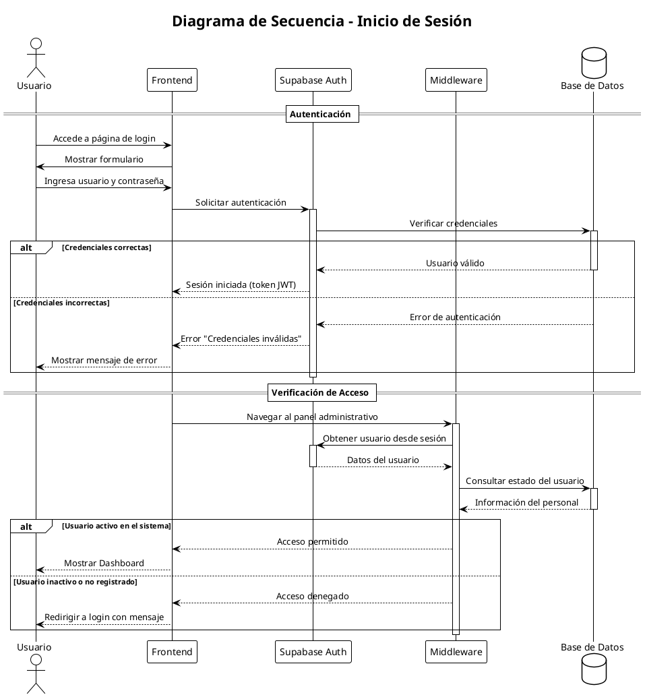
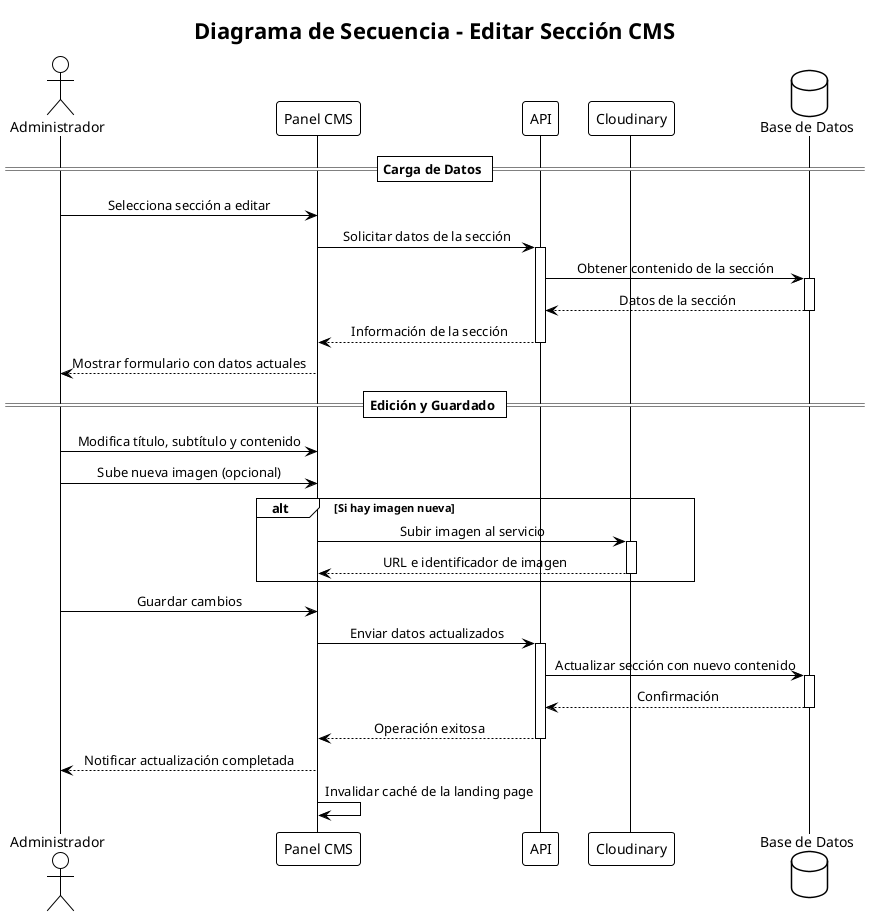
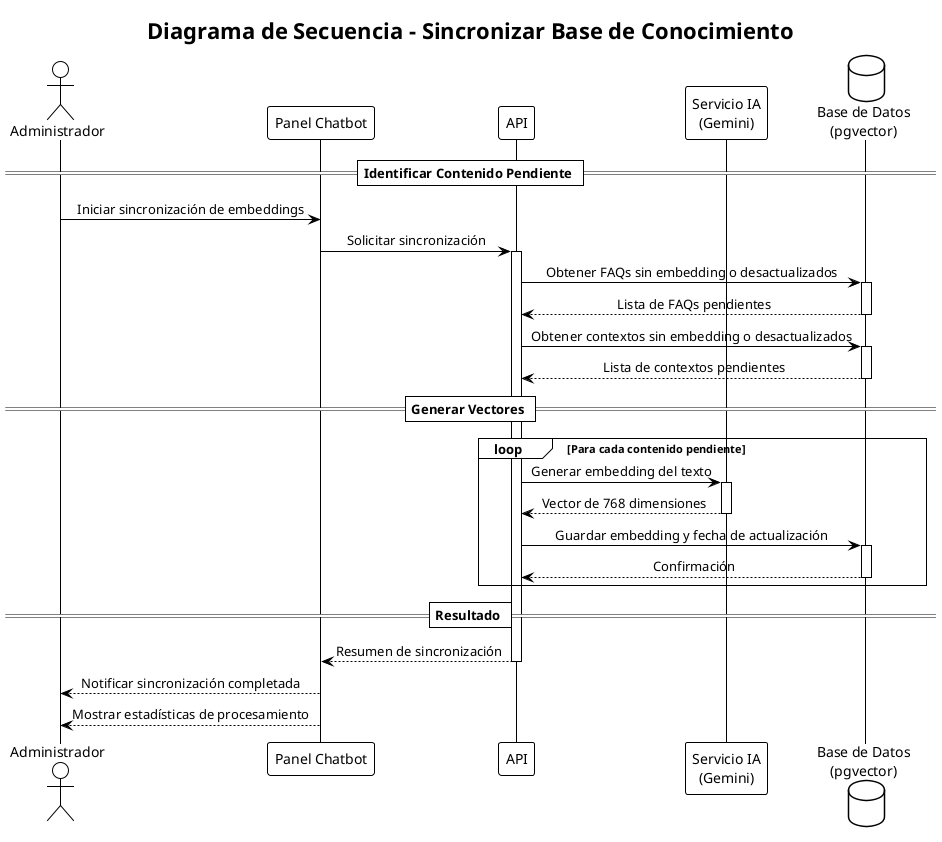
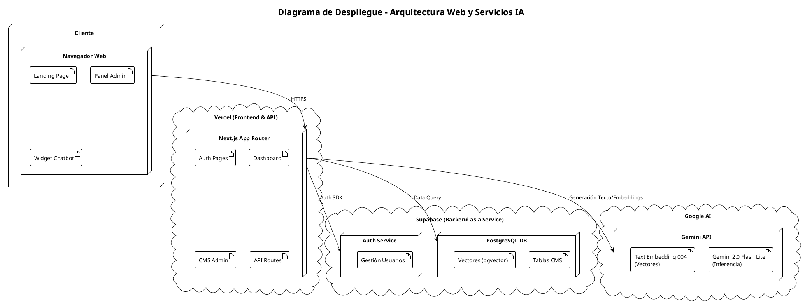

# 📊 Diagramas UML - Sistema Dental Company Web

Este documento contiene los diagramas UML enfocados en los módulos de Landing Page, Administración de Usuarios, Gestión de Contenidos (CMS), Chatbot y Autenticación.
Los diagramas están escritos en sintaxis PlantUML y pueden visualizarse en [PlantText](https://www.planttext.com/).

---

## 📑 Índice

1. [Diagrama de Casos de Uso](#1-diagrama-de-casos-de-uso)
2. [Diagrama de Clases](#2-diagrama-de-clases)
3. [Diagramas de Secuencia](#3-diagramas-de-secuencia)
4. [Modelo Relacional de Base de Datos](#4-modelo-relacional-de-base-de-datos)
5. [Diagrama de Despliegue](#5-diagrama-de-despliegue)

---

## 1. Diagrama de Casos de Uso

### 1.1 Casos de Uso: Administración y Landing Page



---

## 2. Diagrama de Clases

### 2.1 Clases de Autenticación, CMS y Chatbot

```plantuml
@startuml Diagrama_Clases_Core
!theme plain
skinparam classAttributeIconSize 0
skinparam classFontStyle bold
skinparam packageStyle frame
skinparam package {
    BackgroundColor<<auth>> #E8F5E9
    BackgroundColor<<config>> #FFF3E0
    BackgroundColor<<cms>> #E3F2FD
    BackgroundColor<<chatbot>> #F3E5F5
}

title Diagrama de Clases - Core Administrativo y CMS\n(Organizado por Secciones)

' ========================================
' COLUMNA IZQUIERDA
' ========================================
package "🔐 AUTENTICACIÓN Y USUARIOS" <<auth>> {
    class Personal {
        +id: UUID
        +nombre_completo: Text
        +rol: USER-DEFINED
        +especialidad: Text
        +telefono: Text
        +email: Text
        +activo: Boolean
        +created_at: Timestamp
        --
        +actualizarPerfil(): void
    }

    class CodigoInvitacion {
        +id: UUID
        +codigo: Text
        +creado_por: UUID
        +usado_por: UUID
        +rol_asignado: Text
        +usos_maximos: Integer
        +usos_actuales: Integer
        +activo: Boolean
        +expira_at: Timestamp
        +created_at: Timestamp
        +used_at: Timestamp
        --
        +generar(): void
        +validar(): Boolean
    }

    Personal -[hidden]down- CodigoInvitacion
}

package "⚙️ CONFIGURACIÓN DEL SISTEMA" <<config>> {
    class ConfigSeguridad {
        +id: UUID
        +clave: Text
        +valor: Text
        +descripcion: Text
        +updated_at: Timestamp
        --
        +actualizar(): void
    }

    class AjustesAplicacion {
        +id: UUID
        +clave: Text
        +valor: Text
        +grupo: Text
        +tipo: USER-DEFINED
        +descripcion: Text
        +orden: Integer
        +resend_api_key: Text
        +updated_at: Timestamp
        +created_at: Timestamp
        --
        +actualizar(): void
    }

    ConfigSeguridad -[hidden]down- AjustesAplicacion
}

package "🤖 CHATBOT - IA con RAG" <<chatbot>> {
    class ChatbotFAQ {
        +id: UUID
        +pregunta: Text
        +respuesta: Text
        +keywords: Array
        +categoria: Text
        +prioridad: Integer
        +activo: Boolean
        +embedding: Vector(768)
        +created_at: Timestamp
        +updated_at: Timestamp
        +embedding_updated_at: Timestamp
        --
        +crear(): void
        +generarEmbedding(): void
    }

    class ChatbotContexto {
        +id: UUID
        +titulo: Text
        +contenido: Text
        +tipo: Text
        +activo: Boolean
        +embedding: Vector(768)
        +created_at: Timestamp
        +updated_at: Timestamp
        +embedding_updated_at: Timestamp
        --
        +crear(): void
        +generarEmbedding(): void
    }

    class ChatbotRateLimit {
        +id: UUID
        +ip_hash: Text
        +requests_count: Integer
        +first_request_at: Timestamp
        +last_request_at: Timestamp
        +blocked_until: Timestamp
        --
        +verificar(): Boolean
    }

    ChatbotFAQ -[hidden]down- ChatbotContexto
    ChatbotContexto -[hidden]down- ChatbotRateLimit
}

' ========================================
' COLUMNA DERECHA: CMS
' ========================================
package "🌐 CMS - GESTIÓN DE CONTENIDOS" <<cms>> {
    class CMSSeccion {
        +id: UUID
        +seccion: Text
        +titulo: Text
        +subtitulo: Text
        +contenido: JSONB
        +orden: Integer
        +visible: Boolean
        +updated_at: Timestamp
        +updated_by: UUID
        --
        +actualizar(): void
    }

    class CMSServicio {
        +id: UUID
        +nombre: Text
        +descripcion: Text
        +icono: Text
        +orden: Integer
        +visible: Boolean
        +detalle_completo: Text
        +beneficios: Array
        +duracion: Varchar
        +recomendaciones: Text
        +created_at: Timestamp
        +updated_at: Timestamp
        --
        +crear(): void
        +editar(): void
    }

    class CMSServicioImagen {
        +id: UUID
        +servicio_id: UUID
        +imagen_url: Text
        +public_id: Text
        +descripcion: Text
        +alt_text: Text
        +orden: Integer
        +visible: Boolean
        +created_at: Timestamp
        +updated_at: Timestamp
        --
        +subir(): void
    }

    class CMSEquipo {
        +id: UUID
        +nombre: Text
        +cargo: Text
        +especialidad: Text
        +foto_url: Text
        +foto_public_id: Text
        +curriculum: JSONB
        +orden: Integer
        +visible: Boolean
        +created_at: Timestamp
        +updated_at: Timestamp
        --
        +crear(): void
        +editar(): void
    }

    class CMSTema {
        +id: UUID
        +clave: Text
        +valor: Text
        +tipo: Text
        +descripcion: Text
        +grupo: Text
        +updated_at: Timestamp
        --
        +actualizar(): void
    }

    class CMSCarrusel {
        +id: UUID
        +imagen_url: Text
        +alt_text: Text
        +orden: Integer
        +visible: Boolean
        +created_at: Timestamp
        --
        +subir(): void
    }

    CMSSeccion -[hidden]down- CMSServicio
    CMSServicio -[hidden]down- CMSServicioImagen
    CMSServicioImagen -[hidden]down- CMSEquipo
    CMSEquipo -[hidden]down- CMSTema
    CMSTema -[hidden]down- CMSCarrusel
}

' ========================================
' LAYOUT: Forzar columnas
' ========================================
"🔐 AUTENTICACIÓN Y USUARIOS" -[hidden]right- "🌐 CMS - GESTIÓN DE CONTENIDOS"
"🔐 AUTENTICACIÓN Y USUARIOS" -[hidden]down- "⚙️ CONFIGURACIÓN DEL SISTEMA"
"⚙️ CONFIGURACIÓN DEL SISTEMA" -[hidden]down- "🤖 CHATBOT - IA con RAG"

' ========================================
' RELACIONES ENTRE SECCIONES
' ========================================
Personal "1" -- "*" CodigoInvitacion : crea >
Personal "1" -- "*" CMSSeccion : actualiza >
Personal "1" -- "*" CMSServicio : gestiona >
Personal "1" -- "*" CMSEquipo : gestiona >
Personal "1" -- "*" ChatbotFAQ : gestiona >
Personal "1" -- "*" AjustesAplicacion : configura >

CMSServicio "1" -- "*" CMSServicioImagen : tiene >

@enduml
```



---

## 3. Diagramas de Secuencia

### 3.1 Recuperación de Contraseña



### 3.2 Interacción con Chatbot



### 3.3 Registro con Código de Invitación



### 3.4 Inicio de Sesión



### 3.5 Edición de Contenido CMS



### 3.6 Sincronización de Embeddings (RAG)



### 3.7 Visualización del Dashboard (KPIs)

```plantuml
@startuml Secuencia_Dashboard_KPI
!theme plain
skinparam sequenceMessageAlign center

title Diagrama de Secuencia - Carga del Dashboard con KPIs

actor "Usuario" as User
participant "Dashboard" as Dashboard
participant "API" as API
database "Base de Datos" as DB

== Carga de Métricas ==

User -> Dashboard: Accede al panel principal
activate Dashboard

Dashboard -> API: Solicitar resumen de KPIs
activate API

par Consultas en paralelo
    API -> DB: Contar total de pacientes
    activate DB
    DB --> API: Total pacientes
    deactivate DB
and
    API -> DB: Contar citas pendientes
    activate DB
    DB --> API: Citas pendientes
    deactivate DB
and
    API -> DB: Calcular ingresos del mes
    activate DB
    DB --> API: Ingresos mensuales
    deactivate DB
and
    API -> DB: Contar casos clínicos activos
    activate DB
    DB --> API: Casos activos
    deactivate DB
end

API --> Dashboard: Métricas consolidadas
deactivate API

Dashboard --> User: Mostrar tarjetas con indicadores

== Carga de Gráficos ==

Dashboard -> API: Solicitar datos para gráficos
activate API

API -> DB: Obtener datos agregados por período
activate DB
DB --> API: Series de datos temporales
deactivate DB

API --> Dashboard: Datos para visualización
deactivate API

Dashboard --> User: Renderizar gráficos estadísticos
deactivate Dashboard

@enduml
```

---

## 4. Modelo Relacional de Base de Datos

### 4.1 Modelo ER - Módulos Administrativos y CMS

```plantuml
@startuml Modelo_ER_Admin_CMS
!theme plain
skinparam linetype ortho
skinparam packageStyle frame
skinparam package {
    BackgroundColor<<auth>> #E8F5E9
    BackgroundColor<<config>> #FFF3E0
    BackgroundColor<<cms>> #E3F2FD
    BackgroundColor<<chatbot>> #F3E5F5
}

title Modelo ER - Administración, CMS y Chatbot\n(Organizado por Secciones)

' ========================================
' SECCIÓN 1: AUTENTICACIÓN Y USUARIOS
' ========================================
package "🔐 AUTENTICACIÓN Y USUARIOS" <<auth>> {
    entity "auth.users" as users {
        *id : UUID <<PK>>
        --
        email : VARCHAR
        encrypted_password : VARCHAR
        email_confirmed_at : TIMESTAMP
        last_sign_in_at : TIMESTAMP
    }

    entity "personal" as personal {
        *id : UUID <<PK>> <<FK>>
        --
        nombre_completo : TEXT
        rol : USER-DEFINED
        especialidad : TEXT
        telefono : TEXT
        email : TEXT <<UK>>
        activo : BOOLEAN
        created_at : TIMESTAMP
    }

    entity "codigos_invitacion" as codigos {
        *id : UUID <<PK>>
        --
        codigo : TEXT <<UK>>
        creado_por : UUID <<FK>>
        usado_por : UUID <<FK>>
        rol_asignado : TEXT
        usos_maximos : INTEGER
        usos_actuales : INTEGER
        activo : BOOLEAN
        expira_at : TIMESTAMP
        created_at : TIMESTAMP
        used_at : TIMESTAMP
    }
}

' ========================================
' SECCIÓN 2: CONFIGURACIÓN DEL SISTEMA
' ========================================
package "⚙️ CONFIGURACIÓN DEL SISTEMA" <<config>> {
    entity "config_seguridad" as config_seg {
        *id : UUID <<PK>>
        --
        clave : TEXT <<UK>>
        valor : TEXT
        descripcion : TEXT
        updated_at : TIMESTAMP
    }

    entity "ajustes_aplicacion" as ajustes {
        *id : UUID <<PK>>
        --
        clave : TEXT <<UK>>
        valor : TEXT
        grupo : TEXT
        tipo : USER-DEFINED
        descripcion : TEXT
        orden : INTEGER
        resend_api_key : TEXT
        updated_at : TIMESTAMP
        created_at : TIMESTAMP
    }
}

note bottom of config_seg
  También almacena:
  secuencia_historia_{año}
  para generación de HC
end note

' ========================================
' SECCIÓN 3: CMS (GESTIÓN DE CONTENIDOS)
' ========================================
package "🌐 CMS - GESTIÓN DE CONTENIDOS" <<cms>> {
    entity "cms_secciones" as secciones {
        *id : UUID <<PK>>
        --
        seccion : TEXT <<UK>>
        titulo : TEXT
        subtitulo : TEXT
        contenido : JSONB
        orden : INTEGER
        visible : BOOLEAN
        updated_at : TIMESTAMP
        updated_by : UUID <<FK>>
    }

    entity "cms_servicios" as servicios {
        *id : UUID <<PK>>
        --
        nombre : TEXT
        descripcion : TEXT
        icono : TEXT
        orden : INTEGER
        visible : BOOLEAN
        detalle_completo : TEXT
        beneficios : ARRAY
        duracion : VARCHAR
        recomendaciones : TEXT
        created_at : TIMESTAMP
        updated_at : TIMESTAMP
    }

    entity "cms_servicio_imagenes" as serv_img {
        *id : UUID <<PK>>
        --
        servicio_id : UUID <<FK>>
        imagen_url : TEXT
        public_id : TEXT
        descripcion : TEXT
        alt_text : TEXT
        orden : INTEGER
        visible : BOOLEAN
        created_at : TIMESTAMP
        updated_at : TIMESTAMP
    }

    entity "cms_equipo" as equipo {
        *id : UUID <<PK>>
        --
        nombre : TEXT
        cargo : TEXT
        especialidad : TEXT
        foto_url : TEXT
        foto_public_id : TEXT
        curriculum : JSONB
        orden : INTEGER
        visible : BOOLEAN
        created_at : TIMESTAMP
        updated_at : TIMESTAMP
    }

    entity "cms_tema" as tema {
        *id : UUID <<PK>>
        --
        clave : TEXT <<UK>>
        valor : TEXT
        tipo : TEXT
        descripcion : TEXT
        grupo : TEXT
        updated_at : TIMESTAMP
    }

    entity "cms_carrusel" as carrusel {
        *id : UUID <<PK>>
        --
        imagen_url : TEXT
        alt_text : TEXT
        orden : INTEGER
        visible : BOOLEAN
        created_at : TIMESTAMP
    }
}

' ========================================
' SECCIÓN 4: CHATBOT (IA con RAG)
' ========================================
package "🤖 CHATBOT - IA con RAG" <<chatbot>> {
    entity "chatbot_faqs" as faqs {
        *id : UUID <<PK>>
        --
        pregunta : TEXT
        respuesta : TEXT
        keywords : ARRAY
        categoria : TEXT
        prioridad : INTEGER
        activo : BOOLEAN
        embedding : VECTOR(768)
        embedding_updated_at : TIMESTAMP
        created_at : TIMESTAMP
        updated_at : TIMESTAMP
    }

    entity "chatbot_contexto" as contexto {
        *id : UUID <<PK>>
        --
        titulo : TEXT
        contenido : TEXT
        tipo : TEXT
        activo : BOOLEAN
        embedding : VECTOR(768)
        embedding_updated_at : TIMESTAMP
        created_at : TIMESTAMP
        updated_at : TIMESTAMP
    }

    entity "chatbot_rate_limit" as rate_limit {
        *id : UUID <<PK>>
        --
        ip_hash : TEXT <<UK>>
        requests_count : INTEGER
        first_request_at : TIMESTAMP
        last_request_at : TIMESTAMP
        blocked_until : TIMESTAMP
    }
}

' ========================================
' RELACIONES ENTRE SECCIONES
' ========================================
users ||--|| personal : "perfil"
personal ||--o{ codigos : "crea"
users ||--o{ codigos : "usa"
users ||--o{ secciones : "actualiza"
servicios ||--o{ serv_img : "tiene"

@enduml
```



---

## 5. Diagrama de Despliegue



---

## 📝 Notas de Implementación

### Herramientas Utilizadas

- **Frontend:** Next.js 15, React, TypeScript, Tailwind CSS, shadcn/ui
- **Backend:** Next.js API Routes, Server Actions
- **Base de Datos:** PostgreSQL (Supabase)
- **Autenticación:** Supabase Auth con JWT
- **Almacenamiento de Imágenes:** Cloudinary
- **IA/Chatbot:** Gemini 2.0 flash lite, pgvector para embeddings
- **Calendario:** Google Calendar API

### Convenciones de Diagramas

- Los colores en diagramas de estado indican el nivel de actividad
- Las relaciones con líneas punteadas indican dependencias opcionales
- Los estereotipos `<<include>>` y `<<extend>>` siguen la notación UML estándar

---

**Documento generado:** Diciembre 2025
**Sistema:** Dental Company Web v1.0
