# 📊 Diagramas UML - Sistema Dental Company Web

Este documento contiene los diagramas UML enfocados en los módulos de Landing Page, Administración de Usuarios, Gestión de Contenidos (CMS), Chatbot y Autenticación.
Los diagramas están escritos en sintaxis PlantUML y pueden visualizarse en [PlantText](https://www.planttext.com/).

---

## 📑 Índice

1. [Diagrama de Casos de Uso](#1-diagrama-de-casos-de-uso)
   - [1.0 Casos de Uso Nivel 0 - Sistema Completo](#10-casos-de-uso-nivel-0---sistema-completo)
   - [1.1 Casos de Uso: Autenticación y Administración](#11-casos-de-uso-autenticación-y-administración)
   - [1.2 Casos de Uso: Dashboard y Métricas (Detallado)](#12-casos-de-uso-dashboard-y-métricas-detallado)
2. [Diagrama de Clases](#2-diagrama-de-clases)
3. [Diagramas de Secuencia](#3-diagramas-de-secuencia)
4. [Modelo Relacional de Base de Datos](#4-modelo-relacional-de-base-de-datos)
5. [Diagrama de Despliegue](#5-diagrama-de-despliegue)

---

## 1. Diagrama de Casos de Uso

### 1.0 Casos de Uso Nivel 0 - Sistema Completo

```plantuml
@startuml Casos_de_Uso_Nivel_0
!theme plain
left to right direction
skinparam packageStyle rectangle
skinparam actorStyle awesome

title Diagrama de Casos de Uso Nivel 0 - Sistema Dental Company Web Completo

actor "Administrador" as Admin
actor "Odontólogo" as Odontologo
actor "Visitante Web" as Visitante

rectangle "Sistema Dental Company Web" {

    package "Módulo Autenticación" {
        usecase "Gestionar Autenticación\ny Sesiones" as UC_Auth
    }

    package "Módulo Landing Page" {
        usecase "Visualizar Landing\nPage Pública" as UC_Landing
    }

    package "Módulo CMS" {
        usecase "Administrar Contenidos\nde la Web" as UC_CMS
    }

    package "Módulo Chatbot IA" {
        usecase "Interactuar con\nAsistente Virtual" as UC_Chatbot
    }

    package "Módulo Dashboard" {
        usecase "Visualizar Métricas\ny KPIs" as UC_Dashboard
    }

    package "Módulo Personal" {
        usecase "Administrar Usuarios\ny Roles" as UC_Personal
    }

    package "Módulo Pacientes e Historias Clínicas" {
        usecase "Gestionar Pacientes,\nHistorias y Casos" as UC_Pacientes
    }

    package "Módulo Odontograma" {
        usecase "Registrar y Visualizar\nOdontogramas" as UC_Odontograma
    }

    package "Módulo Citas" {
        usecase "Gestionar Calendario\ny Citas" as UC_Citas
    }

    package "Módulo Imágenes" {
        usecase "Gestionar Imágenes\nClínicas" as UC_Imagenes
    }
}

' ========================================
' RELACIONES VISITANTE
' ========================================
Visitante --> UC_Landing
Visitante --> UC_Chatbot

' ========================================
' RELACIONES ODONTÓLOGO
' ========================================
Odontologo --> UC_Auth
Odontologo --> UC_Dashboard
Odontologo --> UC_Pacientes
Odontologo --> UC_Odontograma
Odontologo --> UC_Citas
Odontologo --> UC_Imagenes

' ========================================
' RELACIONES ADMINISTRADOR
' ========================================
Admin --> UC_Auth
Admin --> UC_CMS
Admin --> UC_Dashboard
Admin --> UC_Personal
Admin --> UC_Pacientes
Admin --> UC_Odontograma
Admin --> UC_Citas
Admin --> UC_Imagenes

' ========================================
' NOTAS ACLARATORIAS
' ========================================
note right of UC_Chatbot
  Configuración: Administrador (CMS)
  Interacción: Visitante Web (Landing)
end note

@enduml
```



### 1.1 Casos de Uso: Autenticación y Administración

```plantuml
@startuml Casos_de_Uso_Admin_Landing
!theme plain
left to right direction
skinparam packageStyle rectangle
skinparam actorStyle awesome

title Diagrama de Casos de Uso - Módulos Administrativos y Públicos

actor "Administrador" as Admin
actor "Odontólogo" as Odontologo
actor "Visitante Web" as Visitante

rectangle "Sistema Dental Company Web" {

    package "Autenticación y Cuenta" {
        usecase "Iniciar Sesión" as UC1
        usecase "Registrarse (Invitación)" as UC2
        usecase "Recuperar Contraseña" as UC3
        usecase "Configurar Cuenta" as UC4
        usecase "Gestionar Email Recuperación" as UC5
    }

    package "Dashboard y Métricas" {
        usecase "Ver Dashboard Principal" as UC6
        usecase "Visualizar KPIs" as UC7
    }

    package "Administración de Usuarios" <<Admin>> {
        usecase "Listar Usuarios" as UC8
        usecase "Crear/Invitar Usuario" as UC9
        usecase "Desactivar Usuario" as UC10
        usecase "Asignar Roles" as UC11
    }

    package "Gestión de Contenidos (CMS)" <<Admin>> {
        usecase "Editar Información Clínica" as UC12
        usecase "Gestionar Servicios" as UC13
        usecase "Gestionar Equipo Médico" as UC14
        usecase "Personalizar Tema Visual" as UC15
    }

    package "Chatbot IA" {
        usecase "Consultar Chatbot" as UC16
        usecase "Configurar FAQs" as UC17
        usecase "Configurar Contexto" as UC18
        usecase "Sincronizar Base de Conocimiento" as UC19
    }

    package "Landing Page Pública" {
        usecase "Ver Servicios" as UC20
        usecase "Ver Equipo" as UC21
        usecase "Ver Información Contacto" as UC22
    }
}

' Relaciones Visitante
Visitante --> UC16
Visitante --> UC20
Visitante --> UC21
Visitante --> UC22

' Relaciones Odontólogo
Odontologo --> UC1
Odontologo --> UC2
Odontologo --> UC3
Odontologo --> UC4
Odontologo --> UC6
Odontologo --> UC7

' Relaciones Admin
Admin --> UC1
Admin --> UC2
Admin --> UC3
Admin --> UC4
Admin --> UC6
Admin --> UC7
Admin --> UC8
Admin --> UC9
Admin --> UC10
Admin --> UC11
Admin --> UC12
Admin --> UC13
Admin --> UC14
Admin --> UC15
Admin --> UC17
Admin --> UC18
Admin --> UC19

' Inclusiones y Extensiones
UC4 ..> UC5 : <<include>>
UC6 ..> UC7 : <<include>>

@enduml
```



### 1.2 Casos de Uso: Dashboard y Métricas (Detallado)

```plantuml
@startuml Casos_de_Uso_Dashboard_Detallado
!theme plain
left to right direction
skinparam packageStyle rectangle
skinparam actorStyle awesome

title Diagrama de Casos de Uso - Dashboard y Sistema de Métricas (KPIs)

actor "Administrador" as Admin
actor "Odontólogo" as Odontologo

rectangle "Sistema de Dashboard y Métricas" {

    package "Visualización de KPIs" {
        usecase "Ver Dashboard Principal" as UC_Dashboard
        usecase "Visualizar Métricas de Pacientes" as UC_KPI_Pacientes
        usecase "Visualizar Métricas de Citas" as UC_KPI_Citas
        usecase "Visualizar Métricas Financieras" as UC_KPI_Finanzas
        usecase "Visualizar Métricas de Tratamientos" as UC_KPI_Tratamientos
    }

    package "Métricas de Pacientes" {
        usecase "Ver Total de Pacientes" as UC_Total_Pacientes
        usecase "Ver Pacientes Nuevos del Mes" as UC_Nuevos_Pacientes
        usecase "Ver Crecimiento de Pacientes" as UC_Crecimiento_Pacientes
        usecase "Ver Cumpleaños del Día" as UC_Cumpleanos
    }

    package "Métricas de Citas" {
        usecase "Ver Citas de Hoy" as UC_Citas_Hoy
        usecase "Ver Citas de la Semana" as UC_Citas_Semana
        usecase "Ver Tasa de Asistencia" as UC_Tasa_Asistencia
        usecase "Ver Calendario Mensual" as UC_Calendario
    }

    package "Métricas Financieras" {
        usecase "Ver Ingresos del Mes" as UC_Ingresos_Mes
        usecase "Ver Crecimiento de Ingresos" as UC_Crecimiento_Ingresos
        usecase "Ver Presupuestos Pendientes" as UC_Presupuestos_Pendientes
    }

    package "Métricas de Tratamientos" {
        usecase "Ver Tratamientos por Estado" as UC_Tratamientos_Estado
        usecase "Ver Valor Total de Tratamientos" as UC_Valor_Total
        usecase "Ver Valor Cobrado" as UC_Valor_Cobrado
        usecase "Ver Valor Pendiente de Cobro" as UC_Valor_Pendiente
    }

    package "Gráficos y Reportes" {
        usecase "Ver Gráficos Estadísticos" as UC_Graficos
        usecase "Ver Tendencias Temporales" as UC_Tendencias
        usecase "Filtrar Datos por Período" as UC_Filtrar_Periodo
    }
}

' Relaciones Odontólogo
Odontologo --> UC_Dashboard
Odontologo --> UC_KPI_Pacientes
Odontologo --> UC_KPI_Citas
Odontologo --> UC_KPI_Finanzas
Odontologo --> UC_KPI_Tratamientos
Odontologo --> UC_Graficos
Odontologo --> UC_Calendario

' Relaciones Administrador (hereda todo del Odontólogo)
Admin --> UC_Dashboard
Admin --> UC_KPI_Pacientes
Admin --> UC_KPI_Citas
Admin --> UC_KPI_Finanzas
Admin --> UC_KPI_Tratamientos
Admin --> UC_Graficos
Admin --> UC_Calendario

' Relaciones de Inclusión - Dashboard Principal
UC_Dashboard ..> UC_KPI_Pacientes : <<include>>
UC_Dashboard ..> UC_KPI_Citas : <<include>>
UC_Dashboard ..> UC_KPI_Finanzas : <<include>>
UC_Dashboard ..> UC_Calendario : <<include>>

' Relaciones de Inclusión - KPI Pacientes
UC_KPI_Pacientes ..> UC_Total_Pacientes : <<include>>
UC_KPI_Pacientes ..> UC_Nuevos_Pacientes : <<include>>
UC_KPI_Pacientes ..> UC_Crecimiento_Pacientes : <<include>>

' Relaciones de Inclusión - KPI Citas
UC_KPI_Citas ..> UC_Citas_Hoy : <<include>>
UC_KPI_Citas ..> UC_Citas_Semana : <<include>>
UC_KPI_Citas ..> UC_Tasa_Asistencia : <<include>>

' Relaciones de Inclusión - KPI Finanzas
UC_KPI_Finanzas ..> UC_Ingresos_Mes : <<include>>
UC_KPI_Finanzas ..> UC_Crecimiento_Ingresos : <<include>>
UC_KPI_Finanzas ..> UC_Presupuestos_Pendientes : <<include>>

' Relaciones de Inclusión - KPI Tratamientos
UC_KPI_Tratamientos ..> UC_Tratamientos_Estado : <<include>>
UC_KPI_Tratamientos ..> UC_Valor_Total : <<include>>
UC_KPI_Tratamientos ..> UC_Valor_Cobrado : <<include>>
UC_KPI_Tratamientos ..> UC_Valor_Pendiente : <<include>>

' Relaciones de Inclusión - Gráficos
UC_Graficos ..> UC_Tendencias : <<include>>
UC_Graficos ..> UC_Filtrar_Periodo : <<extend>>

@enduml
```



---

## 2. Diagrama de Clases

### 2.1 Diagrama de Clases - Autenticación, CMS, Landing Page y Chatbot IA

```plantuml
@startuml Diagrama_Clases_Auth_CMS_Chatbot
!theme plain
skinparam classAttributeIconSize 0
skinparam classFontStyle bold

title Diagrama de Clases - Autenticación, CMS, Landing Page y Chatbot IA

' ============================================
' MÓDULO: AUTENTICACIÓN Y USUARIOS
' ============================================

class AuthUser {
  +id: UUID <<PK>>
  +email: Text <<UK>>
  +encrypted_password: Text
  +email_confirmed_at: Timestamp
  +last_sign_in_at: Timestamp
  +created_at: Timestamp
  --
  +autenticar(): Boolean
  +verificarEmail(): void
  +cambiarPassword(): void
}

class Personal {
  +id: UUID <<PK,FK>>
  +nombre_completo: Text
  +rol: Enum(Admin, Odontólogo)
  +especialidad: Text
  +telefono: Text
  +email: Text <<UK>>
  +activo: Boolean
  +created_at: Timestamp
  --
  +actualizarPerfil(): void
  +activar(): void
  +desactivar(): void
}

class CodigoInvitacion {
  +id: UUID <<PK>>
  +codigo: Text <<UK>>
  +creado_por: UUID <<FK>>
  +usado_por: UUID <<FK>>
  +rol_asignado: Text
  +usos_maximos: Integer
  +usos_actuales: Integer
  +activo: Boolean
  +expira_at: Timestamp
  +created_at: Timestamp
  +used_at: Timestamp
  --
  +generar(): void
  +validar(): Boolean
  +registrarUso(): void
}

' ============================================
' MÓDULO: CMS - GESTIÓN DE CONTENIDOS
' ============================================

class CMSSeccion {
  +id: UUID <<PK>>
  +seccion: Text <<UK>>
  +titulo: Text
  +subtitulo: Text
  +contenido: JSONB
  +orden: Integer
  +visible: Boolean
  +updated_at: Timestamp
  +updated_by: UUID <<FK>>
  --
  +actualizar(): void
  +publicar(): void
  +ocultar(): void
}

class CMSServicio {
  +id: UUID <<PK>>
  +nombre: Text
  +descripcion: Text
  +icono: Text
  +orden: Integer
  +visible: Boolean
  +detalle_completo: Text
  +beneficios: Array
  +duracion: Text
  +recomendaciones: Text
  +created_at: Timestamp
  +updated_at: Timestamp
  --
  +crear(): void
  +editar(): void
  +publicar(): void
}

class CMSServicioImagen {
  +id: UUID <<PK>>
  +servicio_id: UUID <<FK>>
  +imagen_url: Text
  +public_id: Text
  +descripcion: Text
  +alt_text: Text
  +orden: Integer
  +visible: Boolean
  +created_at: Timestamp
  +updated_at: Timestamp
  --
  +subir(): void
  +eliminar(): void
  +reordenar(): void
}

class CMSEquipo {
  +id: UUID <<PK>>
  +nombre: Text
  +cargo: Text
  +especialidad: Text
  +foto_url: Text
  +foto_public_id: Text
  +curriculum: JSONB
  +orden: Integer
  +visible: Boolean
  +created_at: Timestamp
  +updated_at: Timestamp
  --
  +crear(): void
  +editar(): void
  +subirFoto(): void
}

class CMSTema {
  +id: UUID <<PK>>
  +clave: Text <<UK>>
  +valor: Text
  +tipo: Text
  +descripcion: Text
  +grupo: Text
  +updated_at: Timestamp
  --
  +actualizar(): void
  +obtenerValor(): Text
}

class CMSCarrusel {
  +id: UUID <<PK>>
  +imagen_url: Text
  +public_id: Text
  +alt_text: Text
  +orden: Integer
  +visible: Boolean
  +created_at: Timestamp
  --
  +subir(): void
  +eliminar(): void
  +reordenar(): void
}

' ============================================
' MÓDULO: CHATBOT IA CON RAG
' ============================================

class ChatbotFAQ {
  +id: UUID <<PK>>
  +pregunta: Text
  +respuesta: Text
  +keywords: Array
  +categoria: Text
  +prioridad: Integer
  +activo: Boolean
  +embedding: Vector(768)
  +embedding_updated_at: Timestamp
  +created_at: Timestamp
  +updated_at: Timestamp
  --
  +crear(): void
  +editar(): void
  +generarEmbedding(): void
  +activar(): void
}

class ChatbotContexto {
  +id: UUID <<PK>>
  +titulo: Text
  +contenido: Text
  +tipo: Text
  +activo: Boolean
  +embedding: Vector(768)
  +embedding_updated_at: Timestamp
  +created_at: Timestamp
  +updated_at: Timestamp
  --
  +crear(): void
  +editar(): void
  +generarEmbedding(): void
  +sincronizar(): void
}

class ChatbotRateLimit {
  +id: UUID <<PK>>
  +ip_hash: Text <<UK>>
  +requests_count: Integer
  +first_request_at: Timestamp
  +last_request_at: Timestamp
  +blocked_until: Timestamp
  --
  +verificar(): Boolean
  +incrementar(): void
  +bloquear(): void
  +resetear(): void
}

' ============================================
' MÓDULO: CONFIGURACIÓN DEL SISTEMA
' ============================================

class ConfigSeguridad {
  +id: UUID <<PK>>
  +clave: Text <<UK>>
  +valor: Text
  +descripcion: Text
  +updated_at: Timestamp
  --
  +actualizar(): void
  +obtenerValor(): Text
}

class AjustesAplicacion {
  +id: UUID <<PK>>
  +clave: Text <<UK>>
  +valor: Text
  +grupo: Text
  +tipo: Enum
  +descripcion: Text
  +orden: Integer
  +updated_at: Timestamp
  +created_at: Timestamp
  --
  +actualizar(): void
  +obtenerPorGrupo(): Array
}

' ============================================
' RELACIONES - AUTENTICACIÓN
' ============================================

AuthUser "1" -- "1" Personal : tiene perfil >
Personal "1" -- "0..*" CodigoInvitacion : crea >
AuthUser "1" -- "0..*" CodigoInvitacion : usa >

' ============================================
' RELACIONES - CMS
' ============================================

Personal "1" -- "0..*" CMSSeccion : actualiza >
Personal "1" -- "0..*" CMSServicio : gestiona >
Personal "1" -- "0..*" CMSEquipo : gestiona >
CMSServicio "1" -- "0..*" CMSServicioImagen : tiene >

' ============================================
' RELACIONES - CHATBOT
' ============================================

Personal "1" -- "0..*" ChatbotFAQ : configura >
Personal "1" -- "0..*" ChatbotContexto : configura >

' ============================================
' RELACIONES - CONFIGURACIÓN
' ============================================

Personal "1" -- "0..*" ConfigSeguridad : modifica >
Personal "1" -- "0..*" AjustesAplicacion : configura >

' ============================================
' NOTAS EXPLICATIVAS
' ============================================

note right of ChatbotFAQ
  Usa embeddings de 768 dimensiones
  generados por Text Embedding 004
  para búsqueda semántica (RAG)
end note

note right of CMSSeccion
  Las secciones incluyen:
  - Hero
  - Nosotros
  - Servicios
  - Testimonios
  - Contacto
end note

note right of Personal
  Roles disponibles:
  - Admin (acceso total)
  - Odontólogo (acceso limitado)
end note

@enduml
```



---

## 3. Diagramas de Secuencia

### 3.1 Recuperación de Contraseña

```plantuml
@startuml Secuencia_Recuperar_Password
!theme plain
skinparam sequenceMessageAlign center

title Diagrama de Secuencia - Recuperación de Contraseña

actor "Usuario" as User
participant "Frontend" as Frontend
participant "Supabase Auth" as Auth
participant "Servicio Email" as Email
database "Base de Datos" as DB

== Solicitud de Recuperación ==

User -> Frontend: Accede a recuperar contraseña
Frontend -> User: Mostrar formulario de email

User -> Frontend: Ingresa su correo electrónico
Frontend -> Auth: Solicitar restablecimiento
activate Auth

Auth -> DB: Verificar existencia del usuario
activate DB
DB --> Auth: Usuario encontrado
deactivate DB

Auth -> Email: Enviar correo con enlace de recuperación
activate Email
Email --> User: Email con enlace seguro
deactivate Email

Auth --> Frontend: Solicitud procesada
deactivate Auth

Frontend --> User: Mostrar confirmación de envío

== Restablecimiento de Contraseña ==

User -> Frontend: Accede al enlace del correo
Frontend -> User: Mostrar formulario de nueva contraseña

User -> Frontend: Ingresa nueva contraseña
Frontend -> Auth: Actualizar contraseña
activate Auth

Auth -> DB: Guardar nueva contraseña cifrada
activate DB
DB --> Auth: Confirmación
deactivate DB

Auth --> Frontend: Contraseña actualizada
deactivate Auth

Frontend --> User: Redirigir a inicio de sesión
Frontend --> User: Notificar cambio exitoso

@enduml
```



### 3.2 Interacción con Chatbot


### 3.3 Registro con Código de Invitación


### 3.4 Inicio de Sesión

```plantuml
@startuml Secuencia_Login
!theme plain
skinparam sequenceMessageAlign center

title Diagrama de Secuencia - Inicio de Sesión

actor "Usuario" as User
participant "Frontend" as Frontend
participant "Supabase Auth" as Auth
participant "Middleware" as MW
database "Base de Datos" as DB

== Autenticación ==

User -> Frontend: Accede a página de login
Frontend -> User: Mostrar formulario

User -> Frontend: Ingresa usuario y contraseña
Frontend -> Auth: Solicitar autenticación
activate Auth

Auth -> DB: Verificar credenciales
activate DB

alt Credenciales correctas
    DB --> Auth: Usuario válido
    deactivate DB
    Auth --> Frontend: Sesión iniciada (token JWT)
else Credenciales incorrectas
    DB --> Auth: Error de autenticación
    Auth --> Frontend: Error "Credenciales inválidas"
    Frontend --> User: Mostrar mensaje de error
end
deactivate Auth

== Verificación de Acceso ==

Frontend -> MW: Navegar al panel administrativo
activate MW

MW -> Auth: Obtener usuario desde sesión
activate Auth
Auth --> MW: Datos del usuario
deactivate Auth

MW -> DB: Consultar estado del usuario
activate DB
DB --> MW: Información del personal
deactivate DB

alt Usuario activo en el sistema
    MW --> Frontend: Acceso permitido
    Frontend --> User: Mostrar Dashboard
else Usuario inactivo o no registrado
    MW --> Frontend: Acceso denegado
    Frontend --> User: Redirigir a login con mensaje
end
deactivate MW

@enduml
```



### 3.5 Edición de Contenido CMS

```plantuml
@startuml Secuencia_CMS_Editar
!theme plain
skinparam sequenceMessageAlign center

title Diagrama de Secuencia - Editar Sección CMS

actor "Administrador" as Admin
participant "Panel CMS" as CMS
participant "API" as API
participant "Cloudinary" as Cloud
database "Base de Datos" as DB

== Carga de Datos ==

Admin -> CMS: Selecciona sección a editar
CMS -> API: Solicitar datos de la sección
activate API

API -> DB: Obtener contenido de la sección
activate DB
DB --> API: Datos de la sección
deactivate DB

API --> CMS: Información de la sección
deactivate API

CMS --> Admin: Mostrar formulario con datos actuales

== Edición y Guardado ==

Admin -> CMS: Modifica título, subtítulo y contenido
Admin -> CMS: Sube nueva imagen (opcional)

alt Si hay imagen nueva
    CMS -> Cloud: Subir imagen al servicio
    activate Cloud
    Cloud --> CMS: URL e identificador de imagen
    deactivate Cloud
end

Admin -> CMS: Guardar cambios

CMS -> API: Enviar datos actualizados
activate API

API -> DB: Actualizar sección con nuevo contenido
activate DB
DB --> API: Confirmación
deactivate DB

API --> CMS: Operación exitosa
deactivate API

CMS --> Admin: Notificar actualización completada
CMS -> CMS: Invalidar caché de la landing page

@enduml
```



### 3.6 Sincronización de Embeddings (RAG)

```plantuml
@startuml Secuencia_Sync_Embeddings
!theme plain
skinparam sequenceMessageAlign center

title Diagrama de Secuencia - Sincronizar Base de Conocimiento

actor "Administrador" as Admin
participant "Panel Chatbot" as Panel
participant "API" as API
participant "Servicio IA\n(Gemini)" as Gemini
database "Base de Datos\n(pgvector)" as DB

== Identificar Contenido Pendiente ==

Admin -> Panel: Iniciar sincronización de embeddings
Panel -> API: Solicitar sincronización
activate API

API -> DB: Obtener FAQs sin embedding o desactualizados
activate DB
DB --> API: Lista de FAQs pendientes
deactivate DB

API -> DB: Obtener contextos sin embedding o desactualizados
activate DB
DB --> API: Lista de contextos pendientes
deactivate DB

== Generar Vectores ==

loop Para cada contenido pendiente
    API -> Gemini: Generar embedding del texto
    activate Gemini
    Gemini --> API: Vector de 768 dimensiones
    deactivate Gemini

    API -> DB: Guardar embedding y fecha de actualización
    activate DB
    DB --> API: Confirmación
    deactivate DB
end

== Resultado ==

API --> Panel: Resumen de sincronización
deactivate API

Panel --> Admin: Notificar sincronización completada
Panel --> Admin: Mostrar estadísticas de procesamiento

@enduml
```



### 3.7 Visualización del Dashboard (KPIs)

```plantuml
@startuml Secuencia_Dashboard_KPI
!theme plain
skinparam sequenceMessageAlign center

title Diagrama de Secuencia - Carga del Dashboard con KPIs

actor "Usuario" as User
participant "Dashboard" as Dashboard
participant "API" as API
database "Base de Datos" as DB

== Carga de Métricas ==

User -> Dashboard: Accede al panel principal
activate Dashboard

Dashboard -> API: Solicitar resumen de KPIs
activate API

par Consultas en paralelo
    API -> DB: Contar total de pacientes
    activate DB
    DB --> API: Total pacientes
    deactivate DB
and
    API -> DB: Contar citas pendientes
    activate DB
    DB --> API: Citas pendientes
    deactivate DB
and
    API -> DB: Calcular ingresos del mes
    activate DB
    DB --> API: Ingresos mensuales
    deactivate DB
and
    API -> DB: Contar casos clínicos activos
    activate DB
    DB --> API: Casos activos
    deactivate DB
end

API --> Dashboard: Métricas consolidadas
deactivate API

Dashboard --> User: Mostrar tarjetas con indicadores

== Carga de Gráficos ==

Dashboard -> API: Solicitar datos para gráficos
activate API

API -> DB: Obtener datos agregados por período
activate DB
DB --> API: Series de datos temporales
deactivate DB

API --> Dashboard: Datos para visualización
deactivate API

Dashboard --> User: Renderizar gráficos estadísticos
deactivate Dashboard

@enduml
```

### 3.8 Edición de Personal

```plantuml
@startuml Secuencia_Editar_Personal
!theme plain
skinparam sequenceMessageAlign center

title Diagrama de Secuencia - Editar información de personal

actor "Administrador" as Admin
participant "Panel Personal" as Panel
participant "Formulario\nEdición" as Form
participant "API Frontend" as API
database "Supabase" as DB

== Cargar Lista de Personal ==

Admin -> Panel: Accede a sección de Personal
activate Panel

Panel -> DB: Consultar personal activo e inactivo
activate DB
DB --> Panel: Lista completa de personal
deactivate DB

Panel --> Admin: Mostrar tabla de personal
deactivate Panel

== Iniciar Edición ==

Admin -> Panel: Clic en "Editar" de un usuario
activate Panel

Panel -> Form: Abrir diálogo de edición con datos actuales
activate Form

Form --> Admin: Mostrar formulario prellenado
note right
  Campos editables:
  - Nombre completo
  - Rol (Admin/Odontólogo)
  - Especialidad
  - Teléfono
  - Estado (Activo/Inactivo)
end note
deactivate Panel

== Guardar Cambios ==

Admin -> Form: Modificar campos
Admin -> Form: Clic en "Guardar"

Form -> API: Enviar datos actualizados
activate API

API -> DB: Actualizar registro de personal con nueva información
activate DB

alt Actualización exitosa
    DB --> API: Confirmación de actualización
    deactivate DB

    API --> Form: Operación exitosa
    deactivate API

    Form --> Admin: Notificación "Personal actualizado correctamente"
    Form -> Form: Cerrar diálogo

    Form -> DB: Recargar lista de personal
    activate DB
    DB --> Form: Lista actualizada
    deactivate DB

    Form --> Admin: Mostrar tabla con cambios aplicados

else Error en actualización
    DB --> API: Error de base de datos
    API --> Form: Mensaje de error
    Form --> Admin: Mostrar mensaje de error
    Form --> Admin: Mantener diálogo abierto
end

deactivate Form

@enduml
```



---

## 4. Modelo Relacional de Base de Datos

### 4.1 Modelo ER - Módulos Administrativos y CMS


---

## 5. Diagrama de Despliegue


---

## 📝 Notas de Implementación

### Herramientas Utilizadas

- **Frontend:** Next.js 15, React, TypeScript, Tailwind CSS, shadcn/ui
- **Backend:** Next.js API Routes, Server Actions
- **Base de Datos:** PostgreSQL (Supabase)
- **Autenticación:** Supabase Auth con JWT
- **Almacenamiento de Imágenes:** Cloudinary
- **IA/Chatbot:** Gemini 2.0 flash lite, pgvector para embeddings
- **Calendario:** Google Calendar API

### Convenciones de Diagramas

- Los colores en diagramas de estado indican el nivel de actividad
- Las relaciones con líneas punteadas indican dependencias opcionales
- Los estereotipos `<<include>>` y `<<extend>>` siguen la notación UML estándar

---

**Documento generado:** Diciembre 2025
**Sistema:** Dental Company Web v1.0
