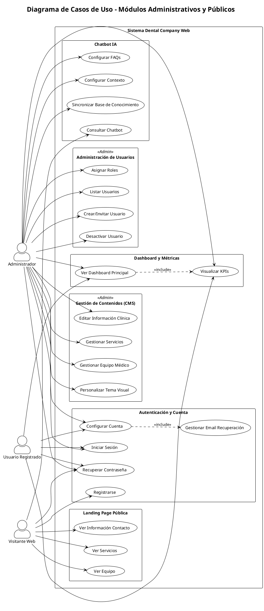
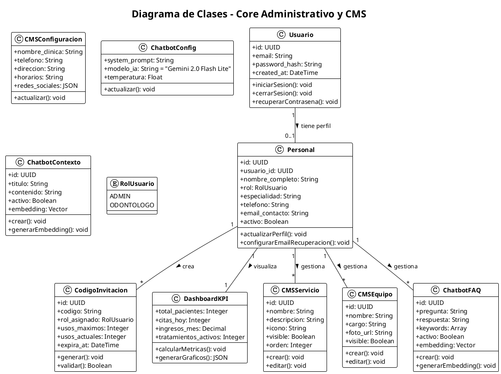
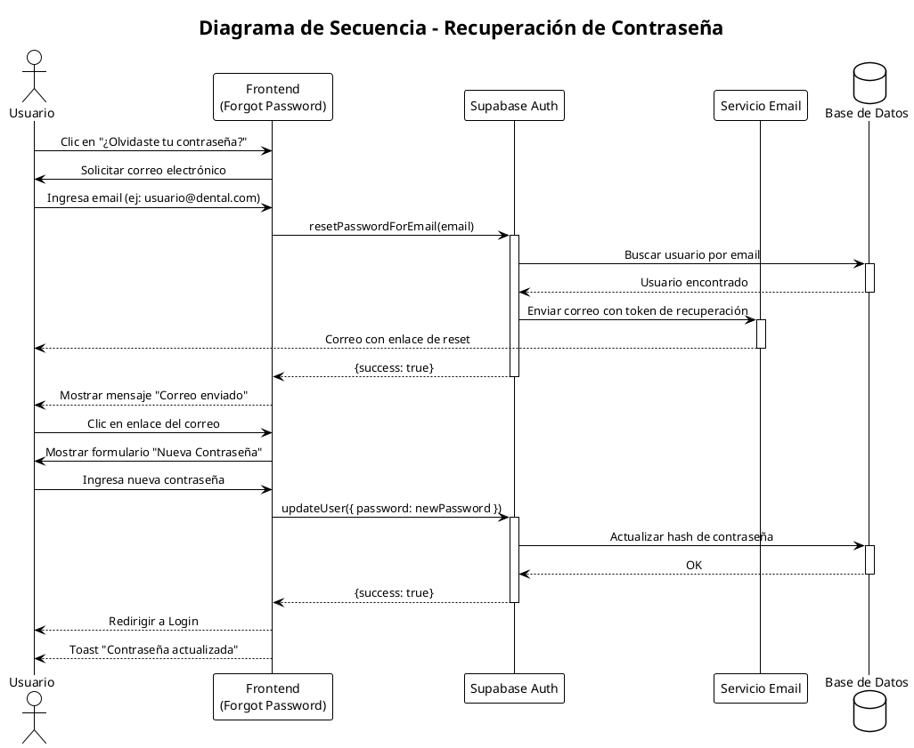
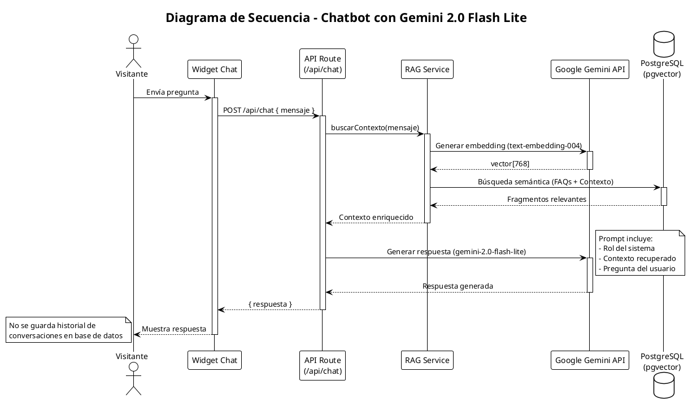
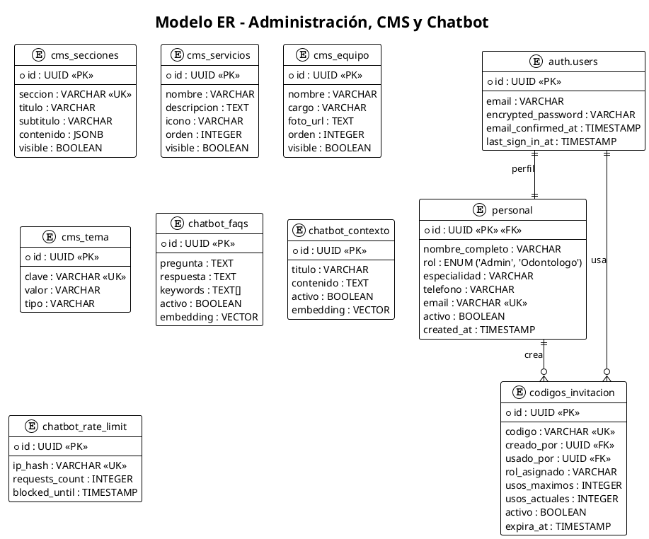

# 📊 Diagramas UML - Sistema Dental Company Web

Este documento contiene los diagramas UML enfocados en los módulos de Landing Page, Administración de Usuarios, Gestión de Contenidos (CMS), Chatbot y Autenticación.
Los diagramas están escritos en sintaxis PlantUML y pueden visualizarse en [PlantText](https://www.planttext.com/).

---

## 📑 Índice

1. [Diagrama de Casos de Uso](#1-diagrama-de-casos-de-uso)
2. [Diagrama de Clases](#2-diagrama-de-clases)
3. [Diagramas de Secuencia](#3-diagramas-de-secuencia)
4. [Modelo Relacional de Base de Datos](#4-modelo-relacional-de-base-de-datos)
5. [Diagrama de Despliegue](#5-diagrama-de-despliegue)

---

## 1. Diagrama de Casos de Uso

### 1.1 Casos de Uso: Administración y Landing Page



---

## 2. Diagrama de Clases

### 2.1 Clases de Autenticación, CMS y Chatbot



---

## 3. Diagramas de Secuencia

### 3.1 Autenticación: Recuperación de Contraseña



### 3.2 Interacción con Chatbot (Gemini 2.0 Flash Lite)



---

## 4. Modelo Relacional de Base de Datos

### 4.1 Modelo ER - Módulos Administrativos y CMS



---

## 5. Diagrama de Despliegue

````plantuml
@startuml Diagrama_Despliegue_Lite
!theme plain
skinparam nodeStyle rectangle

title Diagrama de Despliegue - Arquitectura Web y Servicios IA

node "Cliente" {
    node "Navegador Web" {
        artifact "Landing Page"
        artifact "Panel Admin"
        artifact "Widget Chatbot"
    }
}

cloud "Vercel (Frontend & API)" {
    node "Next.js App Router" {
        artifact "Auth Pages"
        artifact "Dashboard"
        artifact "CMS Admin"
        artifact "API Routes"
    }
}

cloud "Supabase (Backend as a Service)" {
    node "Auth Service" {
        artifact "Gestión Usuarios"
    }
    node "PostgreSQL DB" {
        artifact "Tablas CMS"
        artifact "Vectores (pgvector)"
    }
}

cloud "Google AI" {
    node "Gemini API" {
        artifact "Gemini 2.0 Flash Lite\n(Inferencia)"
        artifact "Text Embedding 004\n(Vectores)"
    }
}

' Conexiones
"Navegador Web" --> "Next.js App Router" : HTTPS
"Next.js App Router" --> "Auth Service" : Auth SDK
"Next.js App Router" --> "PostgreSQL DB" : Data Query
"Next.js App Router" --> "Gemini API" : Generación Texto/Embeddings

@enduml
```---

## 📝 Notas de Implementación

### Herramientas Utilizadas

- **Frontend:** Next.js 14, React, TypeScript, Tailwind CSS, shadcn/ui
- **Backend:** Next.js API Routes, Server Actions
- **Base de Datos:** PostgreSQL (Supabase)
- **Autenticación:** Supabase Auth con JWT
- **Almacenamiento de Imágenes:** Cloudinary
- **IA/Chatbot:** Gemini 2.0 flash lite, pgvector para embeddings
- **Calendario:** Google Calendar API

### Convenciones de Diagramas

- Los colores en diagramas de estado indican el nivel de actividad
- Las relaciones con líneas punteadas indican dependencias opcionales
- Los estereotipos `<<include>>` y `<<extend>>` siguen la notación UML estándar

---

**Documento generado:** Diciembre 2025
**Sistema:** Dental Company Web v1.0
````
