# 📊 Diagramas UML - Sistema Dental Company Web (Mermaid)

Este documento contiene los diagramas UML enfocados en los módulos de Landing Page, Administración de Usuarios, Gestión de Contenidos (CMS), Chatbot y Autenticación.
Los diagramas están escritos en sintaxis Mermaid y pueden visualizarse directamente en GitHub, VS Code o cualquier visor compatible.

---

## 📑 Índice

1. [Diagrama de Casos de Uso](#1-diagrama-de-casos-de-uso)
2. [Diagrama de Clases](#2-diagrama-de-clases)
3. [Diagramas de Secuencia](#3-diagramas-de-secuencia)
4. [Modelo Relacional de Base de Datos](#4-modelo-relacional-de-base-de-datos)
5. [Diagrama de Despliegue](#5-diagrama-de-despliegue)

---

## 1. Diagrama de Casos de Uso

### 1.1 Casos de Uso: Administración y Landing Page

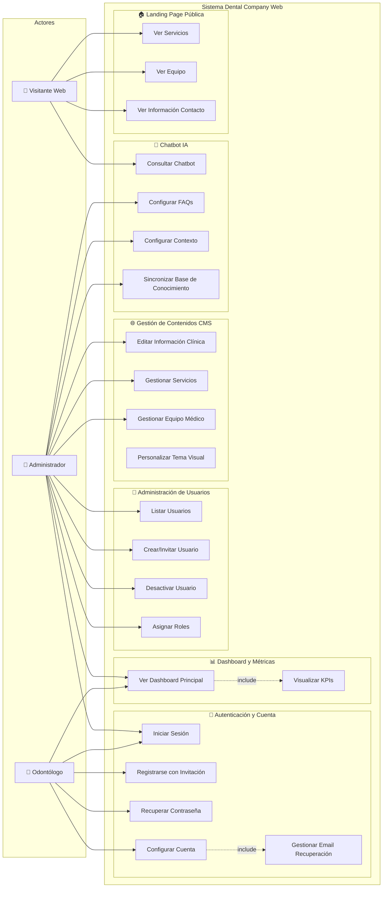

---

## 2. Diagrama de Clases

### 2.1 Clases de Autenticación, CMS y Chatbot

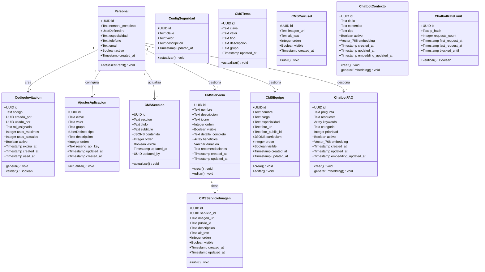

---

## 3. Diagramas de Secuencia

### 3.1 Recuperación de Contraseña

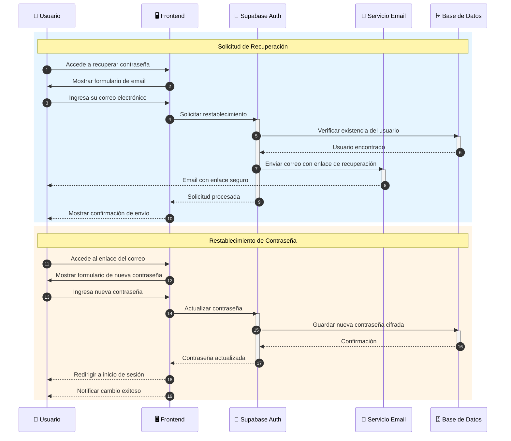

### 3.2 Interacción con Chatbot

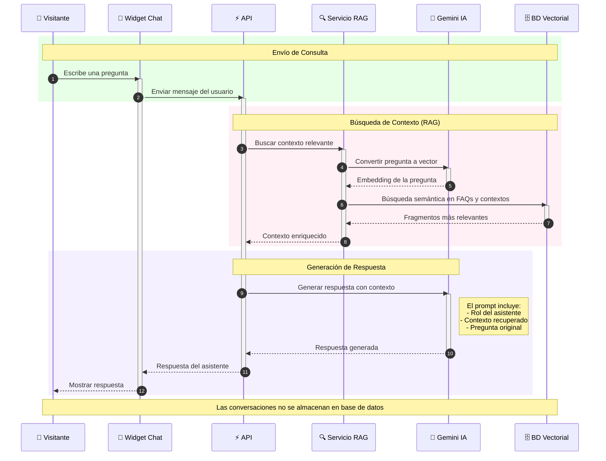

### 3.3 Registro con Código de Invitación

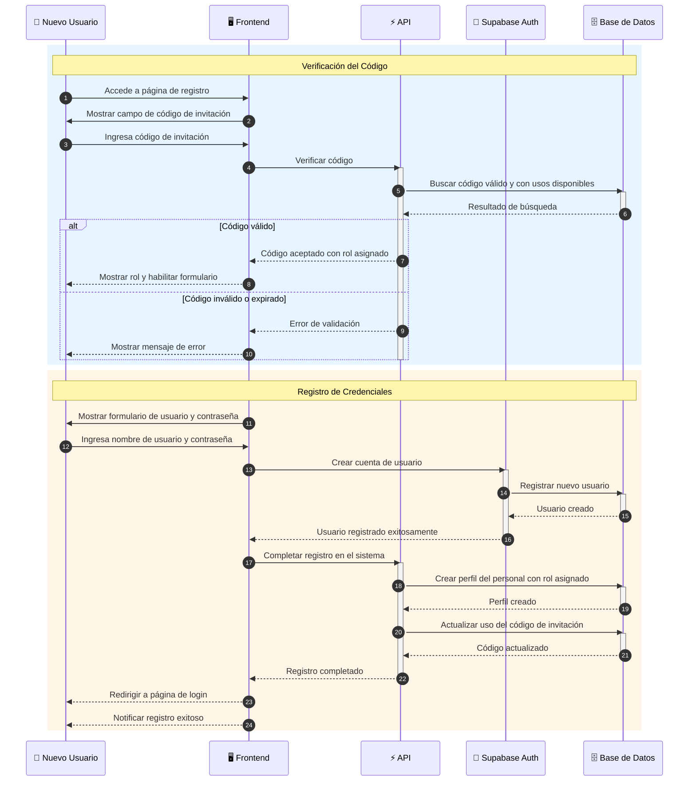

### 3.4 Inicio de Sesión

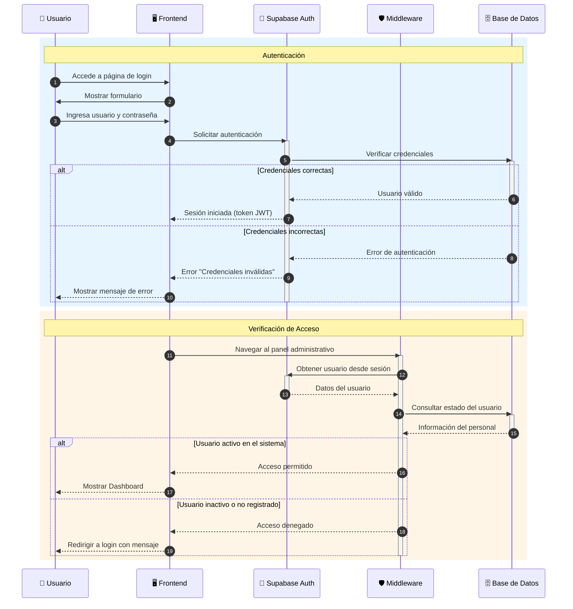

### 3.5 Edición de Contenido CMS

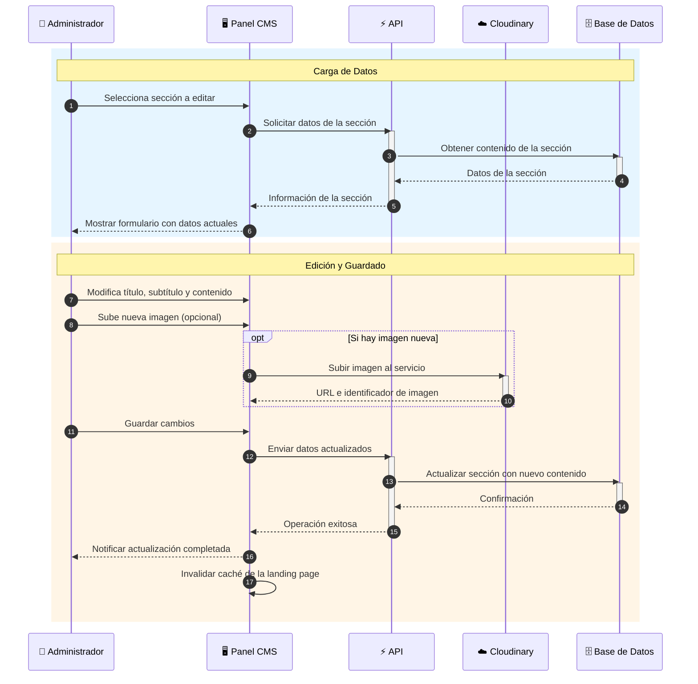

### 3.6 Sincronización de Embeddings (RAG)

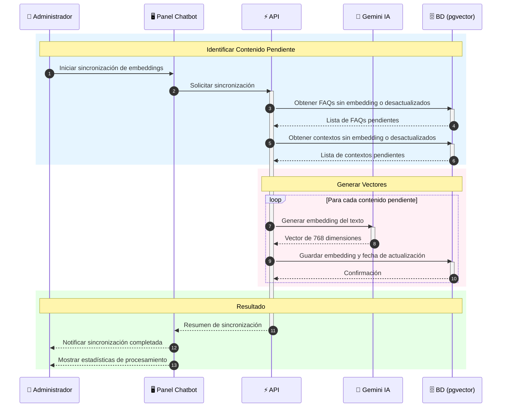

### 3.7 Visualización del Dashboard (KPIs)

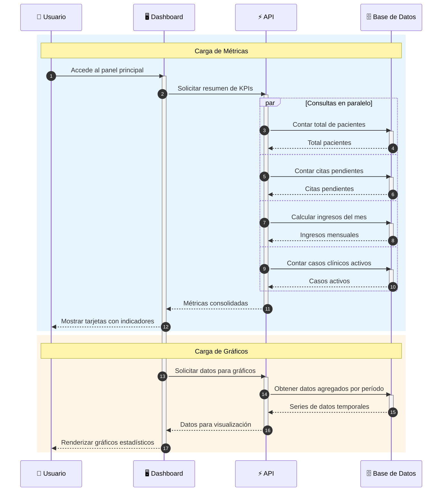

---

## 4. Modelo Relacional de Base de Datos

### 4.1 Modelo ER - Módulos Administrativos y CMS

```mermaid
erDiagram
    %% ========================================
    %% SECCIÓN 1: AUTENTICACIÓN Y USUARIOS
    %% ========================================
    auth_users {
        UUID id PK
        VARCHAR email
        VARCHAR encrypted_password
        TIMESTAMP email_confirmed_at
        TIMESTAMP last_sign_in_at
    }

    personal {
        UUID id PK,FK
        TEXT nombre_completo
        USER_DEFINED rol
        TEXT especialidad
        TEXT telefono
        TEXT email UK
        BOOLEAN activo
        TIMESTAMP created_at
    }

    codigos_invitacion {
        UUID id PK
        TEXT codigo UK
        UUID creado_por FK
        UUID usado_por FK
        TEXT rol_asignado
        INTEGER usos_maximos
        INTEGER usos_actuales
        BOOLEAN activo
        TIMESTAMP expira_at
        TIMESTAMP created_at
        TIMESTAMP used_at
    }

    %% ========================================
    %% SECCIÓN 2: CONFIGURACIÓN DEL SISTEMA
    %% ========================================
    config_seguridad {
        UUID id PK
        TEXT clave UK
        TEXT valor
        TEXT descripcion
        TIMESTAMP updated_at
    }

    ajustes_aplicacion {
        UUID id PK
        TEXT clave UK
        TEXT valor
        TEXT grupo
        USER_DEFINED tipo
        TEXT descripcion
        INTEGER orden
        TEXT resend_api_key
        TIMESTAMP updated_at
        TIMESTAMP created_at
    }

    %% ========================================
    %% SECCIÓN 3: CMS (GESTIÓN DE CONTENIDOS)
    %% ========================================
    cms_secciones {
        UUID id PK
        TEXT seccion UK
        TEXT titulo
        TEXT subtitulo
        JSONB contenido
        INTEGER orden
        BOOLEAN visible
        TIMESTAMP updated_at
        UUID updated_by FK
    }

    cms_servicios {
        UUID id PK
        TEXT nombre
        TEXT descripcion
        TEXT icono
        INTEGER orden
        BOOLEAN visible
        TEXT detalle_completo
        ARRAY beneficios
        VARCHAR duracion
        TEXT recomendaciones
        TIMESTAMP created_at
        TIMESTAMP updated_at
    }

    cms_servicio_imagenes {
        UUID id PK
        UUID servicio_id FK
        TEXT imagen_url
        TEXT public_id
        TEXT descripcion
        TEXT alt_text
        INTEGER orden
        BOOLEAN visible
        TIMESTAMP created_at
        TIMESTAMP updated_at
    }

    cms_equipo {
        UUID id PK
        TEXT nombre
        TEXT cargo
        TEXT especialidad
        TEXT foto_url
        TEXT foto_public_id
        JSONB curriculum
        INTEGER orden
        BOOLEAN visible
        TIMESTAMP created_at
        TIMESTAMP updated_at
    }

    cms_tema {
        UUID id PK
        TEXT clave UK
        TEXT valor
        TEXT tipo
        TEXT descripcion
        TEXT grupo
        TIMESTAMP updated_at
    }

    cms_carrusel {
        UUID id PK
        TEXT imagen_url
        TEXT public_id
        TEXT alt_text
        INTEGER orden
        BOOLEAN visible
        TIMESTAMP created_at
    }

    %% ========================================
    %% SECCIÓN 4: CHATBOT (IA con RAG)
    %% ========================================
    chatbot_faqs {
        UUID id PK
        TEXT pregunta
        TEXT respuesta
        ARRAY keywords
        TEXT categoria
        INTEGER prioridad
        BOOLEAN activo
        VECTOR_768 embedding
        TIMESTAMP embedding_updated_at
        TIMESTAMP created_at
        TIMESTAMP updated_at
    }

    chatbot_contexto {
        UUID id PK
        TEXT titulo
        TEXT contenido
        TEXT tipo
        BOOLEAN activo
        VECTOR_768 embedding
        TIMESTAMP embedding_updated_at
        TIMESTAMP created_at
        TIMESTAMP updated_at
    }

    chatbot_rate_limit {
        UUID id PK
        TEXT ip_hash UK
        INTEGER requests_count
        TIMESTAMP first_request_at
        TIMESTAMP last_request_at
        TIMESTAMP blocked_until
    }

    %% ========================================
    %% RELACIONES ENTRE SECCIONES
    %% ========================================
    auth_users ||--|| personal : "perfil"
    personal ||--o{ codigos_invitacion : "crea"
    auth_users ||--o{ codigos_invitacion : "usa"
    auth_users ||--o{ cms_secciones : "actualiza"
    cms_servicios ||--o{ cms_servicio_imagenes : "tiene"
```

---

## 5. Diagrama de Despliegue

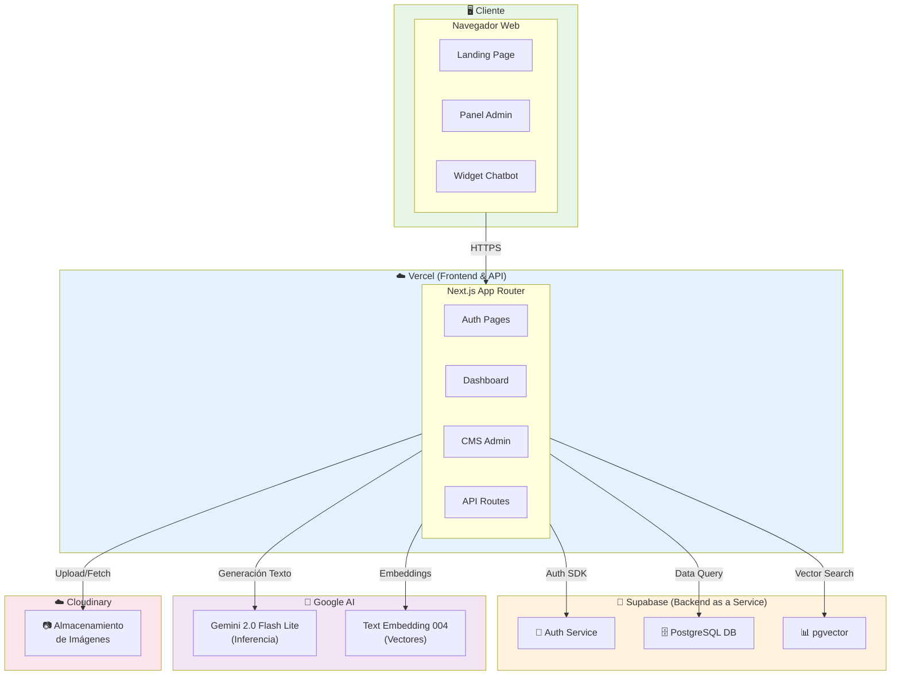

### 5.1 Arquitectura de Componentes

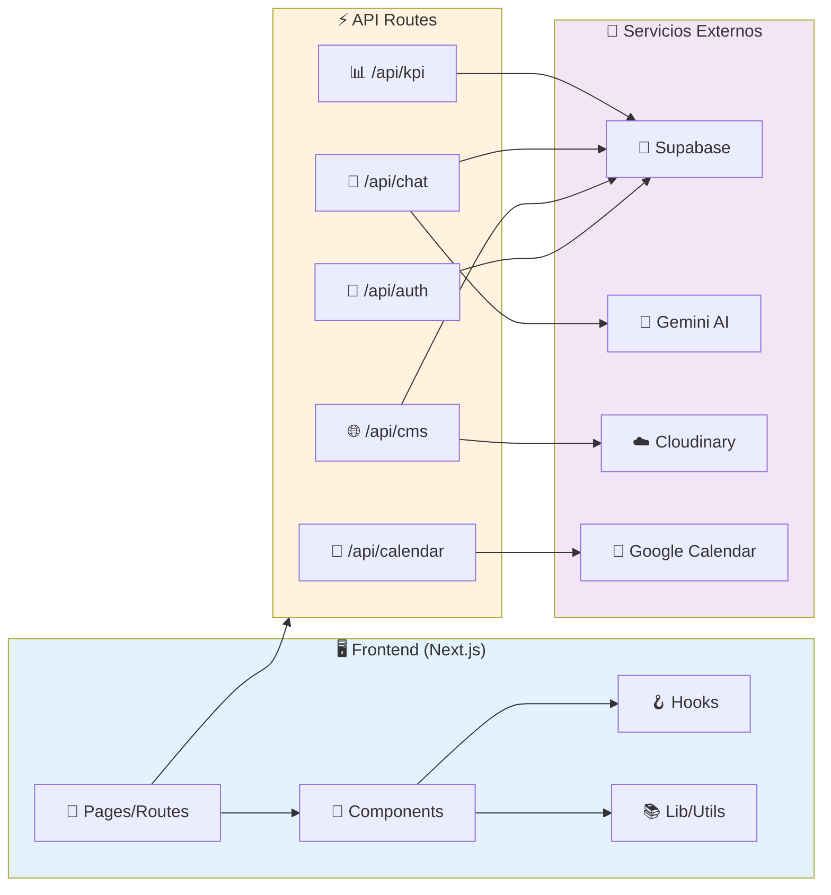

---

## 📝 Notas de Implementación

### Herramientas Utilizadas

| Categoría          | Tecnología                                             |
| ------------------ | ------------------------------------------------------ |
| **Frontend**       | Next.js 15, React, TypeScript, Tailwind CSS, shadcn/ui |
| **Backend**        | Next.js API Routes, Server Actions                     |
| **Base de Datos**  | PostgreSQL (Supabase)                                  |
| **Autenticación**  | Supabase Auth con JWT                                  |
| **Almacenamiento** | Cloudinary                                             |
| **IA/Chatbot**     | Gemini 2.0 flash lite, pgvector para embeddings        |
| **Calendario**     | Google Calendar API                                    |

### Convenciones de Diagramas

- Los colores en diagramas de estado indican el nivel de actividad
- Las relaciones con líneas punteadas indican dependencias opcionales
- Los bloques `rect` en secuencias agrupan fases del proceso

### Visualización

Los diagramas Mermaid pueden visualizarse en:

- ✅ GitHub (renderizado automático)
- ✅ VS Code (con extensión Mermaid Preview)
- ✅ [Mermaid Live Editor](https://mermaid.live)
- ✅ GitLab, Notion, Obsidian y otros

---

**Documento generado:** Diciembre 2025  
**Sistema:** Dental Company Web v1.0
